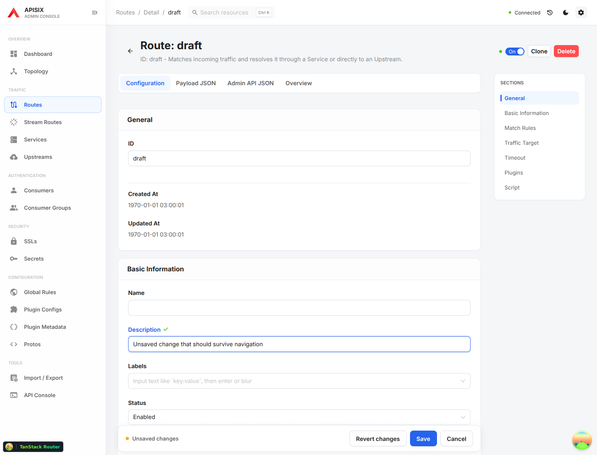
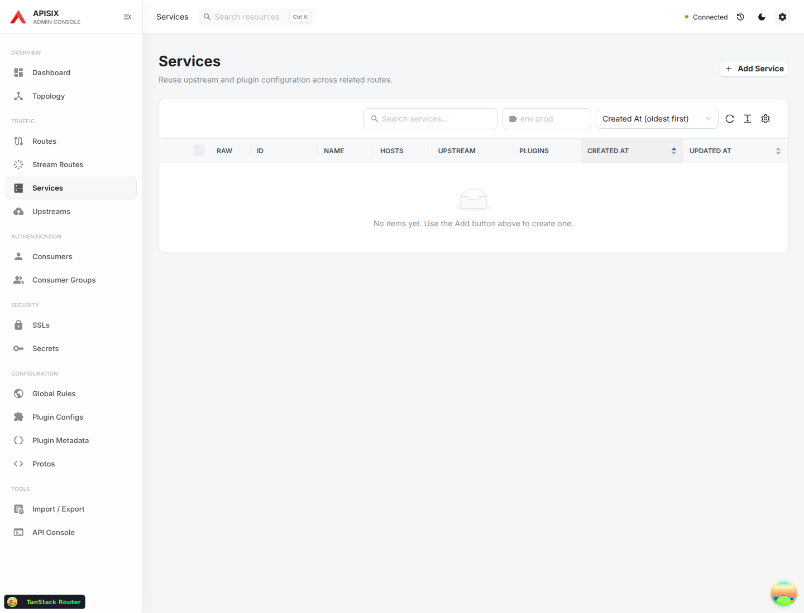
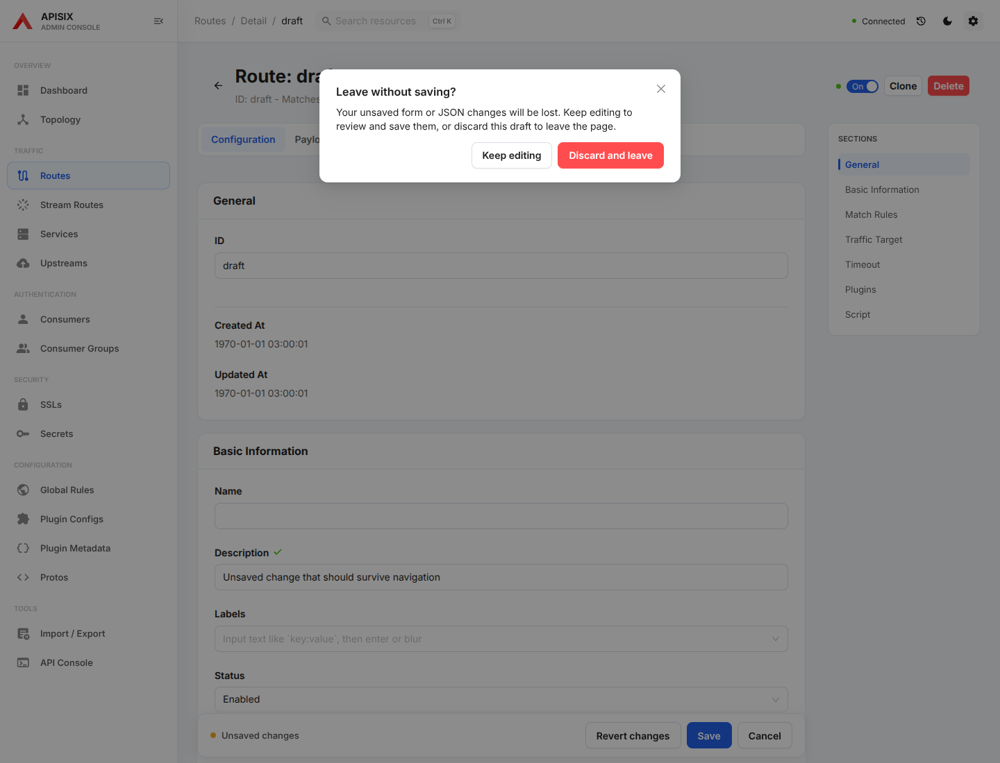
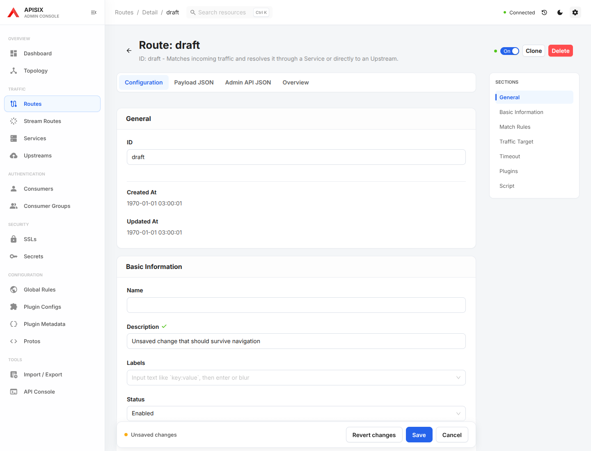
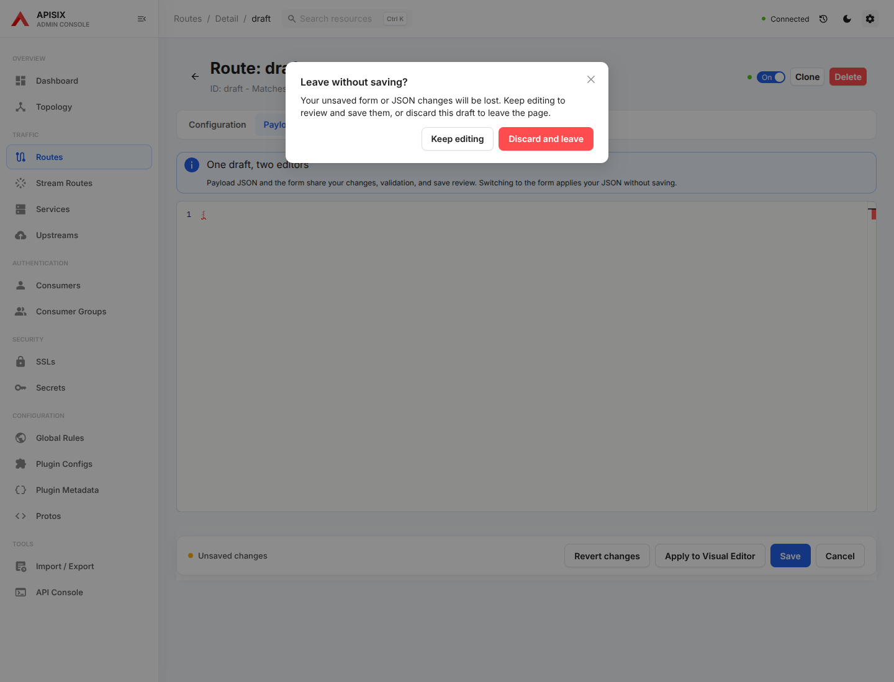
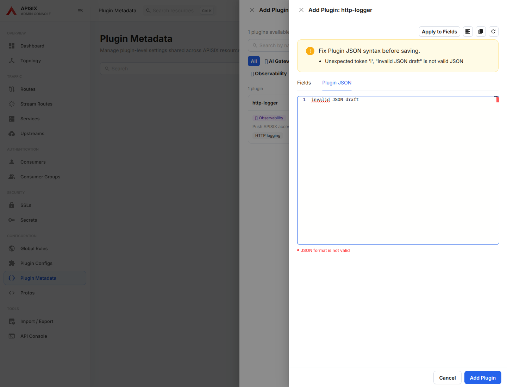
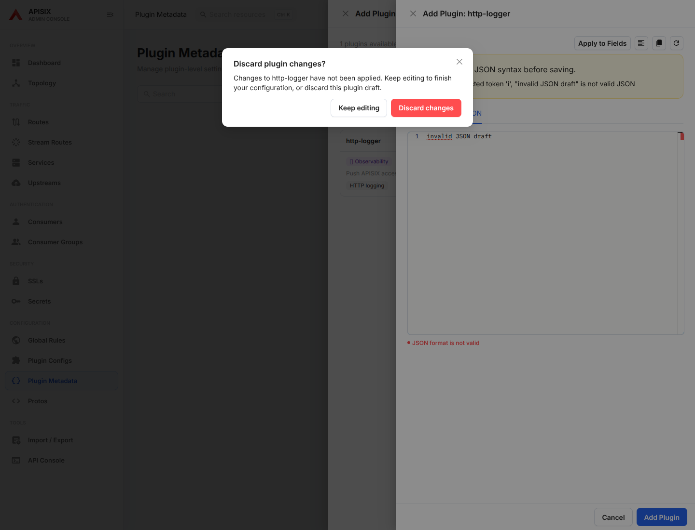

<!--
Licensed to the Apache Software Foundation (ASF) under one or more
contributor license agreements. See the NOTICE file distributed with
this work for additional information regarding copyright ownership.
The ASF licenses this file to You under the Apache License, Version 2.0
(the "License"); you may not use this file except in compliance with
the License. You may obtain a copy of the License at

http://www.apache.org/licenses/LICENSE-2.0

Unless required by applicable law or agreed to in writing, software
distributed under the License is distributed on an "AS IS" BASIS,
WITHOUT WARRANTIES OR CONDITIONS OF ANY KIND, either express or implied.
See the License for the specific language governing permissions and
limitations under the License.
-->

# Editor draft protection audit

Baseline: `439c18f` (PR #55). Scope: leaving a resource editor and closing a
plugin drawer. All screenshots were captured and inspected in this audit run
at 1440 × 1100 with mocked Admin API responses. Baseline resource screens used
the development server; plugin and all after screenshots used a production build.

The existing unsaved indicator, save review, and inline JSON syntax feedback
make editing understandable. They did not protect the user's work at the point
where navigation or closing a drawer destroys it.

| Step | Observed problem | Change / health after correction |
| --- | --- | --- |
| 1. Edit and navigate | High: the form says “Unsaved changes”, but a sidebar click leaves immediately; browser Back restores the saved value, losing the draft. | Protected: Keep editing preserves the form; Discard and leave continues to the requested destination. |
| 2. Cancel or go Back from JSON | The shared editor had tab-switch protection but no route-leaving guard. | Protected: incomplete Payload JSON and independent Admin API JSON both participate in navigation protection. Refresh uses the browser's native before-unload confirmation. |
| 3. Close a plugin editor | High: Cancel closes an invalid JSON draft immediately, despite visible syntax feedback. | Protected: Cancel and Close ask before discarding. Keep editing preserves the text; successful application and unchanged configurations close directly. |

## 1. Resource navigation

Before: the warning in the action bar does not prevent accidental navigation.

The next screen appears without confirmation. Returning restores the saved
value, which was asserted in the baseline browser run.

After: the choice is explicit and the destructive action is labeled.

Choosing Keep editing retains the field value.

## 2. JSON and browser navigation

The same guard covers both JSON editors. This after-state shows an incomplete
Payload JSON document protected during browser Back. Canceling refresh also
retains the draft in the browser regression test.

An unchanged or successfully saved resource can leave normally. Successful
creation still navigates to its detail page. Confirmed resource deletion makes
its local draft obsolete and does not require a second discard confirmation.

## 3. Plugin drawer

Before: syntax feedback exists, but Cancel discards this text immediately.

After: closing asks whether to keep editing or discard the plugin draft.

## Verification and limits

Targeted browser coverage includes retaining and discarding form edits, Cancel
and browser Back from incomplete JSON, independent API JSON, canceled refresh,
normal navigation after save, create redirection, confirmed deletion, and
plugin Cancel/Close. Existing form/JSON parity and save regression tests also run.

The dialogs use named actions and distinguish destructive choices visually.
This is not a full screen-reader, contrast, mobile, or browser compatibility audit.
Native before-unload wording and availability are browser-controlled. Drafts
remain in memory; this change does not add automatic persistence or crash recovery.
Plugin protection in this pass covers drawer closing; it does not add a separate
browser-navigation guard for an unapplied plugin draft. Standalone Raw Drawer
and API Console flows are outside this batch.
