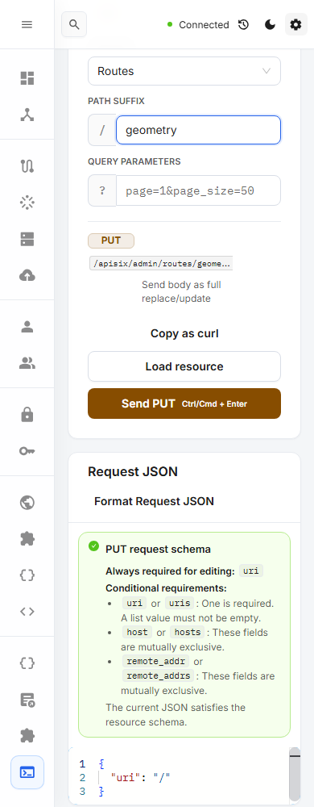
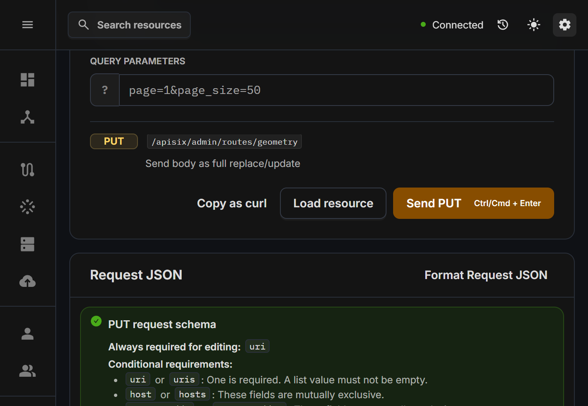

# Final combined Console verification

Checkpoint: 2026-10-05 (Asia/Seoul), merged feature source `9c3349e15a3f4af2411d4c246cfd50db153832c3`.

The Console method-color correction (PR 124) and compact layout correction (PR 125) were verified together after all feature PRs merged. The [task ledger](../../en/recursive-improvement-backlog.md) retains all 20 approved tasks, 40 discovered follow-ups and their individual PR evidence.

## Verification

- `pnpm lint`, `pnpm exec tsc -b --pretty false`, and `pnpm build`: passed.
- The command below passed **16/16 in 3.6 minutes**, with one worker and no retries, against the production preview on port 19243. Tests intercept Admin API requests and reject unexpected requests; this is frontend/contract evidence, not live gateway mutation coverage.
- Both themes cover 320/390/1440 px and native 200% browser zoom. Native zoom keeps the outer window unchanged, halves the CSS viewport and doubles DPR while visual scale and CSS zoom remain 1.
- All 212 enabled-text color measurements meet 4.5:1; minimum 4.85334683710562:1. Geometry checks cover actual text containment, header non-overlap and page overflow. Keyboard confirmation/cancel/focus return and response actions remain covered.
- The refreshed dependency audit reports zero vulnerabilities at every severity. Package manifest, lockfile and workspace inputs are unchanged from the audited revision `6a219415`.

```sh
E2E_TARGET_URL=http://127.0.0.1:19243/ui/ pnpm exec playwright test \
  e2e/tests/console-method-contrast.spec.ts e2e/tests/console-responsive.spec.ts \
  --workers=1 --retries=0 --reporter=list --output test-results/final-console
```

Native zoom uses the existing test-owned Chromium profile/extension helper. Set `E2E_NATIVE_ZOOM_EXECUTABLE` when a full Chromium executable is not in the default Playwright cache. The temporary preview was stopped after verification.

## Synthetic screenshots

These captures come from the combined build above. They contain fixture data only. The light 390 px view shows complete Send text/shortcut and a wrapped Request JSON header; the dark capture shows the same actions at native 200% zoom.





Measurements: [light 390 px](console-light-390-geometry.json), [dark native 200%](console-dark-native200-geometry.json).

## Local feature-build deployment

The feature build was deployed to port 19180 with assets first and index last. The built and HTTP-served index share SHA-256 `76207D3A54BEAF4F73938AFAC92CAA3AFF0B1E8108EE6BD5AB40242D346CDF25`. A fresh authenticated Routes tab at 390 x 844 showed Connected and 14 Routes, a 32.5 px-high title, visible Add Route and no page overflow or console errors. No gateway resource was changed. The populated-screen capture stays local; the temporary viewport was reset.

This evidence identifies the feature revision above. It does not claim future documentation-PR CI or a later build-metadata hash has already been verified.
