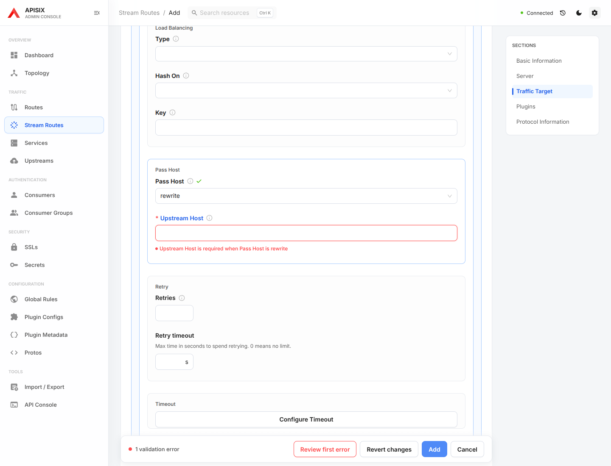
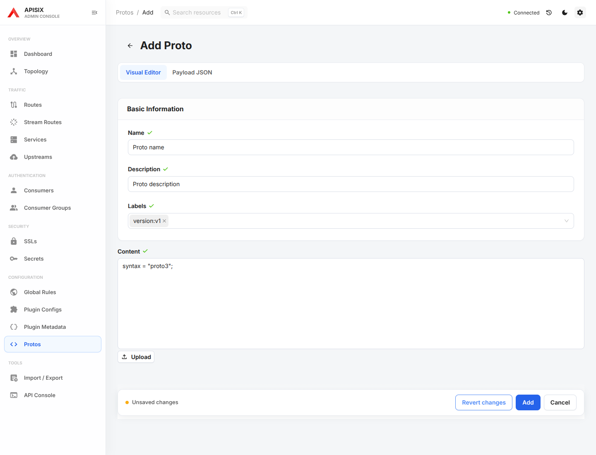

# Resource form / JSON parity

Scope: creation and editing for all resource editors listed below. This is a code and browser regression audit of the dashboard's current
resource model, not a claim that the local schemas cover every APISIX version.

## Field coverage matrix

Common identity, description and labels are rendered by `FormPartBasic` where
applicable. Server-generated IDs/timestamps and certificate validity are not
editable payload fields. JSON remains the full-payload editing surface.

| Resource | Visual controls / structured JSON controls | Validation and preservation finding | Resolution |
| --- | --- | --- | --- |
| Route | `uri/uris`, `host/hosts`, `remote_addr/remote_addrs`, methods, WebSocket, priority/status, vars, filter function, script/script ID, service/upstream/plugin-config references, inline upstream, plugins, timeout | Earlier Route work already retains JSON-only fields and opaque plugin/vars values, and shares matching/inline-upstream validation | Retained; existing Route regression suite rerun |
| Service | hosts, WebSocket, script, upstream reference or inline configuration, plugins | Resolver stripped fields outside the local schema; recursive cleanup changed plugin/discovery values; inline backend/rewrite validation absent | Preserve raw validated input and mounted/unmounted fields; clean only known optional controls; share inline validation with Admin API JSON |
| Stream Route | server address/port, remote address, SNI, service/upstream references, inline upstream, plugins, protocol name/superior ID/conf/logger | Same stripping/cleanup and inline-validation gaps; protocol config is opaque JSON | Same preservation and validation fix, including protocol values |
| Upstream | nodes, discovery name/type/args, scheme, balancing/hash/key, pass-host/rewrite host, retries, timeout, TLS, keepalive, active/passive checks | Unknown nested fields were stripped and opaque discovery values cleaned; checks entered in JSON could appear disabled in the visual editor | Retain payload fields and opaque values; infer check switches after JSON replaces the draft; explicit removal still deletes checks |
| Consumer | username, consumer-group reference, plugins, description/labels | JSON-only fields and plugin empty/null/internal-looking keys could be lost | Preserve validated input and opaque plugin values on create and edit |
| SSL | certificate type, SNI/SNIs, default/additional cert-key pairs, protocols/status/labels, client CA/depth/skip-mTLS regex | JSON client config could be removed because `__clientEnabled` was absent; unknown client fields stripped | Infer switch from client config, preserve JSON client settings, explicitly remove client config when disabled; omit validity metadata |
| Consumer Group | name, description, labels, plugins | Older resolver and recursive cleanup; supported `name` hidden in form/model | Same validated-input preservation; expose `name` |
| Global Rule | identity and plugins | Older resolver and recursive cleanup | Preserve opaque plugin configuration in create/edit/direct JSON |
| Plugin Config | name, description, labels, plugins | Older resolver and recursive cleanup | Same preservation and payload preparation |
| Credential | identity, name, description, labels, credential plugin | Older resolver/cleanup; supported `name` hidden in form/model | Same preservation and expose `name` |
| Secret | Vault, AWS and GCP configuration | Older resolver/cleanup; inactive provider fields can leak when retention is enabled | Preserve opaque settings; retain provider drafts in memory and exclude inactive fields |
| Proto | content, name, description, labels | Basic fields missing in schema/form; older resolver/cleanup | Expose basic metadata and preserve JSON-only fields |
| Plugin Metadata | schema-generated Fields and Plugin JSON | Separate drawer saves configuration directly | Round-trip regression confirms opaque values survive field edits; no save-pipeline change needed |

`discovery_args`, Stream protocol `conf`/`logger`, Route vars and plugin JSON are
intentional JSON controls inside the visual form. A dedicated text box for every
provider/plugin-specific property would not constitute complete schema coverage.
Unmodeled top-level or nested properties remain editable through Payload JSON
and survive visual round trips in the resource editors above.

## Problems corrected

1. **Form/JSON round trip — fixed.** The resolver validates known properties but
   returns the original input. React Hook Form retains fields without rendered
   controls. This also preserves deliberate deletion: JSON omission is not
   merged with the old resource to resurrect removed fields.
2. **Save preparation — fixed.** The payload preview, save review and mutation
   use the same preparation function. Optional form strings are cleaned at known
   paths; arbitrary plugin/discovery/protocol objects are never recursively
   cleaned. Empty strings, nulls, false and nested `__` keys retain their meaning.
3. **Inline backend validation — fixed.** Service and Stream Route creation,
   editing and Admin API JSON use the same inline validator as Routes. Missing
   backend nodes/discovery, incomplete discovery pairs and a missing rewrite
   host now report the same nested field path. No inline upstream remains valid
   (for example a plugin-only Service).
4. **Configuration switches — fixed.** Client verification and health checks
   supplied in JSON are reflected in the form. Turning them off explicitly
   deletes the corresponding payload section.

## Browser evidence

The tests use the production build and mocked Admin API responses so unknown
future fields can be checked without depending on a particular server version.
They assert the actual outgoing request body, not just editor text.

## Verification

- TypeScript, full ESLint and production build.
- Parameterized create/edit round trips and direct Payload JSON saves for all
  primary resource types, plus the remaining six form families and three Secret
  providers.
- Service/Stream Route validation equivalence across create, edit and Admin API
  JSON schemas, plus browser error correction and save.
- Explicit SSL client removal, JSON-only field deletion and JSON health-check
  activation/removal.
- Existing Route editor and unsaved-navigation regressions.

The PR records the final local and real-APISIX CI results. Fake certificates and
unknown extension fields in mocked tests do not establish server acceptance.
Server-side validation remains authoritative for those fields.

## Completion of the remaining resource review

The remaining six form families now use the same validated-input preservation
and focused payload preparation as the primary editors. Tests cover create,
edit and direct JSON save, including all three Secret providers and GCP nested
configuration. Provider alternatives remain in memory while switching; only the
active provider's known fields enter the payload.

The new basic fields are supported by the [pinned upstream schema](https://github.com/apache/apisix/blob/c6b2adc32ed358ee68c83b91de21d951b9c000a0/apisix/schema_def.lua).
CI builds `apache/apisix:dev`; a user's connected server may use a different
version. This comparison does not certify every constraint for every release.

## Remaining audit queue

- Finish the pinned upstream comparison for SSL and node constraints, retaining
  server-side validation for version-dependent or opaque configuration.
- Review SSL certificate/key array pairing and SNI conflict handling: existing
  visual warnings are not a complete server-equivalent validator.
- Exercise upstream node editing with IPv6 and additional node properties;
  the node table has its own object/array conversion separate from this fix.
