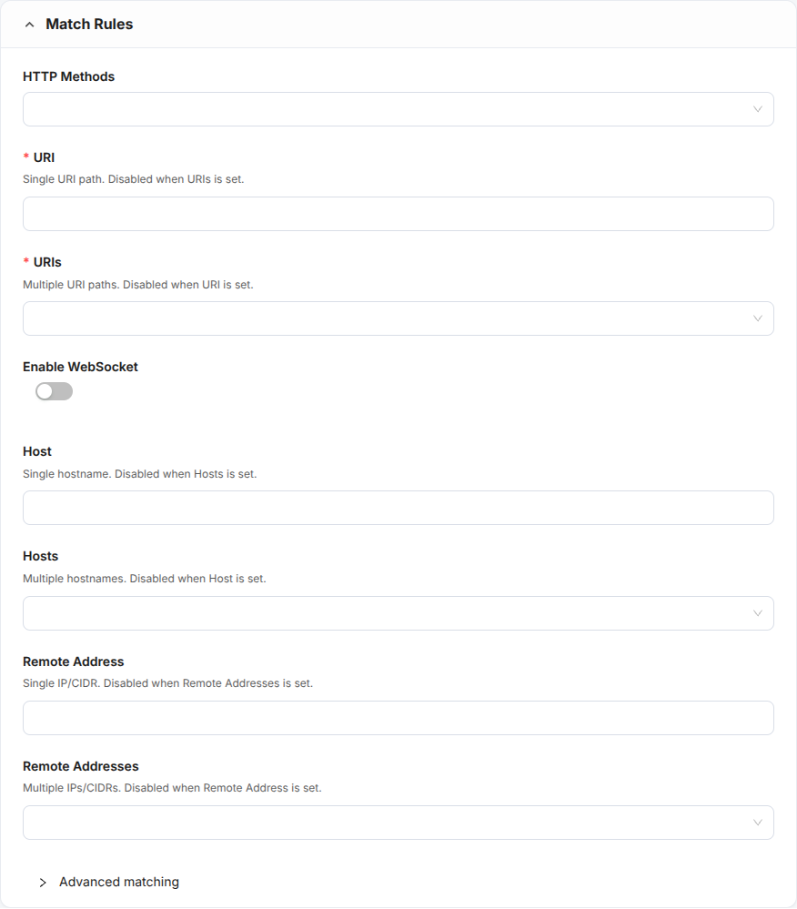
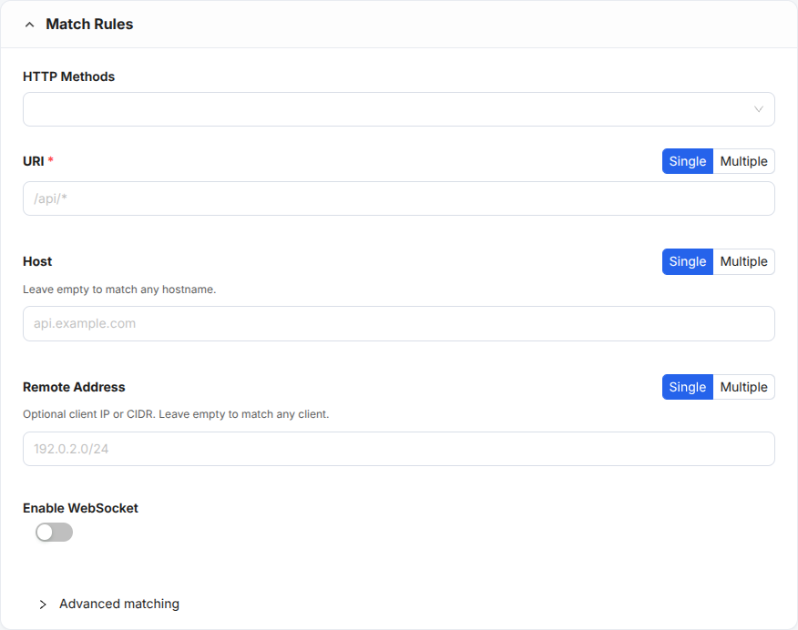
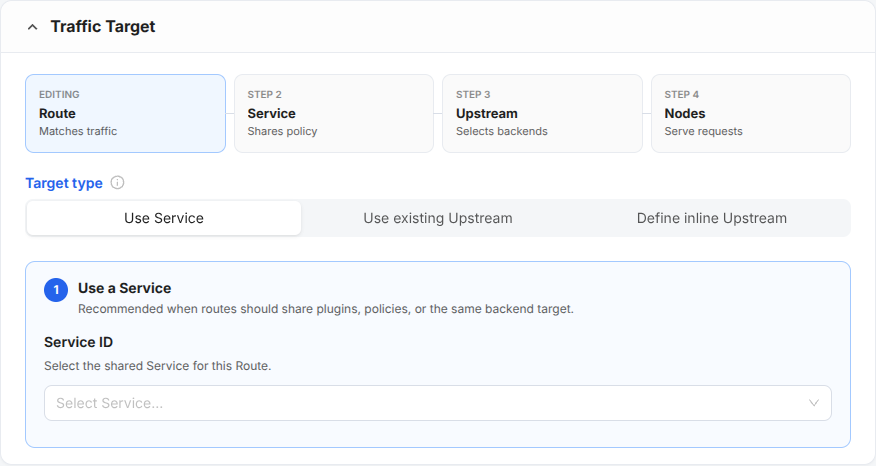
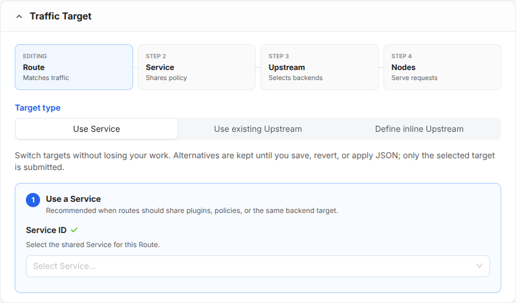
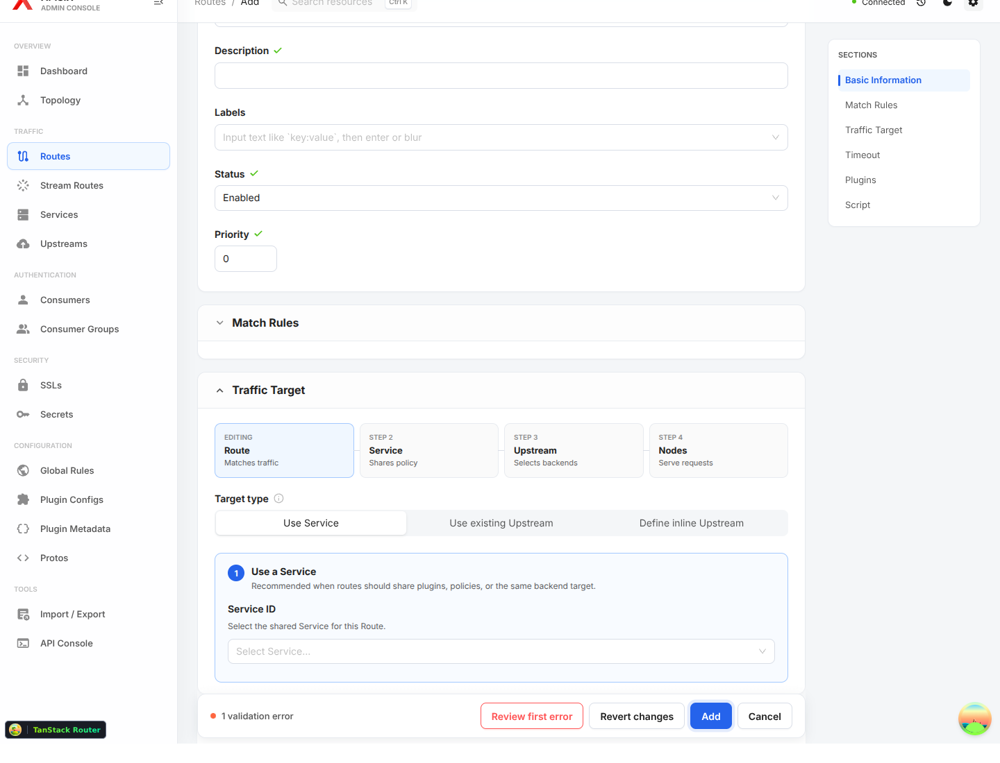
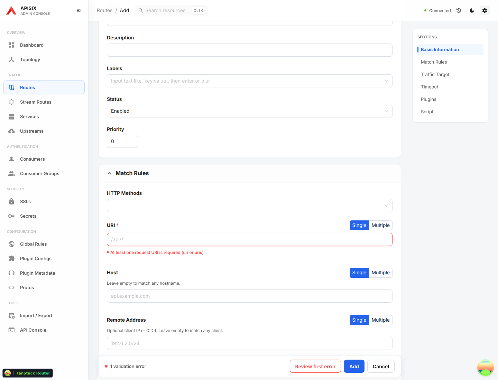
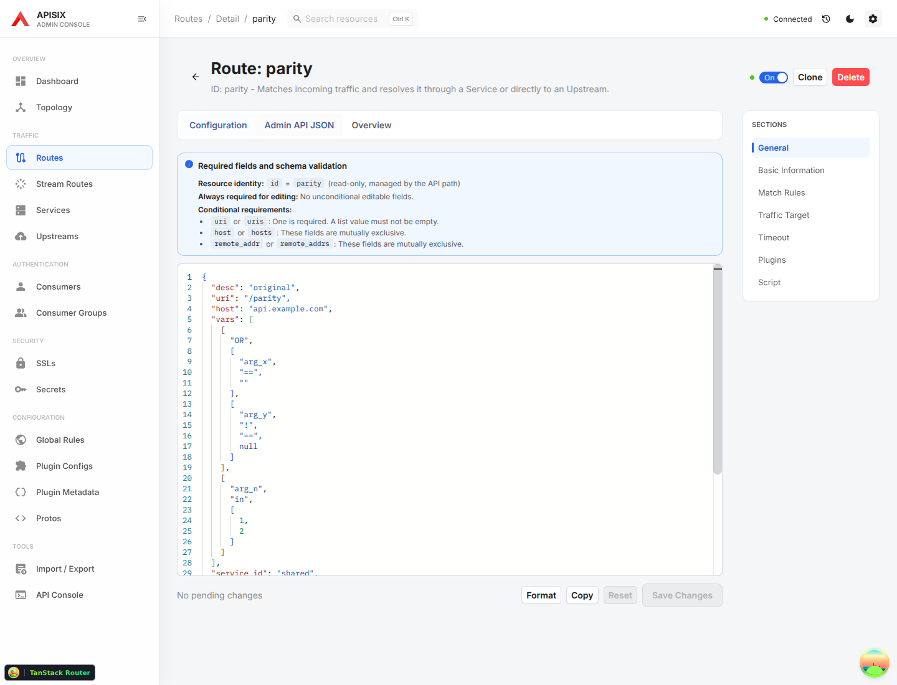
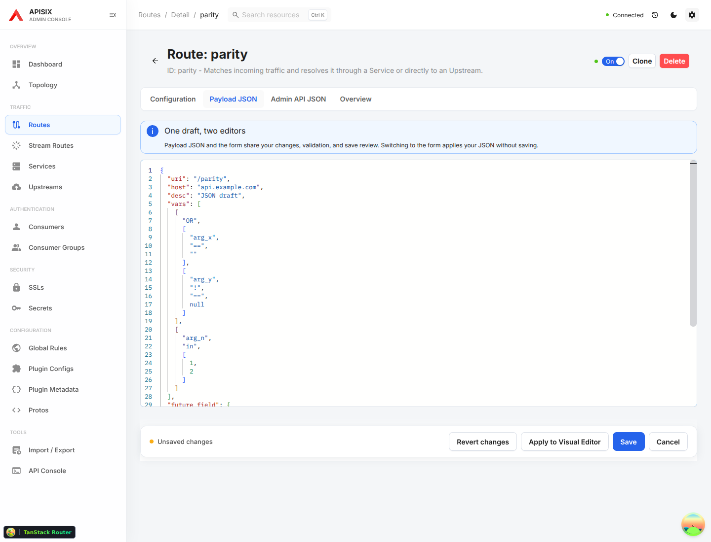

<!--
Licensed to the Apache Software Foundation (ASF) under one or more
contributor license agreements. See the NOTICE file distributed with
this work for additional information regarding copyright ownership.
The ASF licenses this file to You under the Apache License, Version 2.0
(the "License"); you may not use this file except in compliance with
the License. You may obtain a copy of the License at

http://www.apache.org/licenses/LICENSE-2.0

Unless required by applicable law or agreed to in writing, software
distributed under the License is distributed on an "AS IS" BASIS,
WITHOUT WARRANTIES OR CONDITIONS OF ANY KIND, either express or implied.
See the License for the specific language governing permissions and
limitations under the License.
-->

# Route editor usability audit and improvements

Scope: Route creation, matching, target selection, error recovery, and JSON editing.
Baseline: `ba2d3e3` (PR #53). Screenshots were captured in this audit run with a
1440 × 1100 desktop viewport and mocked Admin API responses. This is a focused
workflow audit, not a complete dashboard or accessibility certification.

The shared schema, explicit API field names, save diff, and readback verification
are useful foundations. The remaining friction comes from making users manage
representation details and separate drafts themselves.

| Step | Baseline health / criticism | Implemented behavior | Priority |
| --- | --- | --- | --- |
| 1. Match requests | Needs improvement: six scalar/list inputs repeat three concepts; both URI fields look required. Disabled alternatives provide no clear conversion path. | One visible input per concept with Single/Multiple controls. Scalar values carry over into lists. Narrowing a list requires choosing the value to keep; Cancel preserves the list. Existing conflicting JSON remains visible and correctable. | High |
| 2. Select a target | At risk: switching target clears previous selections and inline configuration; users must re-enter them when comparing options. | Alternatives remain in memory for the current editing session. Only the selected target is submitted after explicit switching. Save, revert, and JSON replacement clear inactive alternatives. | High |
| 3. Recover from errors | Broken: Review first error scrolls to a collapsed Match Rules card without revealing the URI input. | Error navigation reveals ancestor sections and focuses the invalid control. Section navigation opens collapsed sections. Collapsed form controls are inert and hidden from assistive technology. | High |
| 4. Edit JSON and save | At risk: create supports a shared Payload JSON draft, but detail exposes a separate API editor. Hidden form section links remain beside JSON. | Detail also has Payload JSON with form round trips, the same validation and save review. Independent Admin API JSON remains available with explicit discard/cancel protection. Form section navigation disappears outside visible form panels. | High |

## 1. Match requests

Before:

After:

## 2. Select a target

Before:

After:

## 3. Recover from errors

Before: the action bar reports an error while the relevant input stays collapsed.

After:

## 4. Edit JSON and save

Before:

After:

## Verification and limits

Regression coverage includes scalar/list conversion and cancellation, conflicting
fields, JSON/form round trips, unknown-field preservation, target restoration,
inactive-target exclusion, clearing drafts after save/revert, collapsed error
focus, section navigation, separate API draft protection, health-check removal,
and failed readback feedback. Local browser tests use mocked API responses;
live APISIX coverage is performed by the repository CI.

Accessible names and invalid-input focus were exercised. A complete screen-reader,
contrast, touch, mobile, and zoom audit remains outside this pass. Target alternatives
are intentionally in-memory only and do not survive page reload. Existing advanced
API editing semantics remain available; this pass does not replace the PATCH editor
or change APISIX resource shapes.
