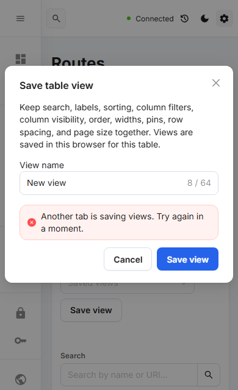

# Saved-view retry accessibility

The shared CI failure in runs 37194422148 and 37194743289 happened after a correctly rejected concurrent save. The saved list was unchanged, and the retry button was enabled. Ant Design's loading icon remained in its leave transition, however, so the button's accessible name remained `loading Save view` instead of `Save view`. The strict role locator could no longer find the action.

The CI trace shows `ant-btn-loading` and the disabled attribute removed while `ant-btn-loading-icon-motion-leave-start` remained. The unchanged production fixture also reproduced this locally: two failures among the first ten completed repetitions. This is an accessible-name regression during transient loading, rather than evidence of an overwritten saved view or a failed lock release.

The control now keeps the visible `Save view` / `Update view` label as its explicit accessible name, and exposes progress separately through `aria-busy`. Existing disabled/loading behavior, native locking, storage validation, conflict warnings, and explicit user retry are preserved. No delay, looser selector, automatic retry, or gateway mutation was introduced.

Verification:

- Both deterministic Save/Update accessibility fixtures fail against the baseline because the loading icon changes the accessible name.
- The fixtures hold a real native lock request, inspect disabled/busy state, then verify the conflict, unchanged stored list, foreground return, and explicit successful retry.
- All 46 saved-view/table production fixtures passed; lint, TypeScript, and production build passed.
- Strict original lock test and new Save/Update tests repeated ten times each: all 30 passed in 1.2 minutes.

