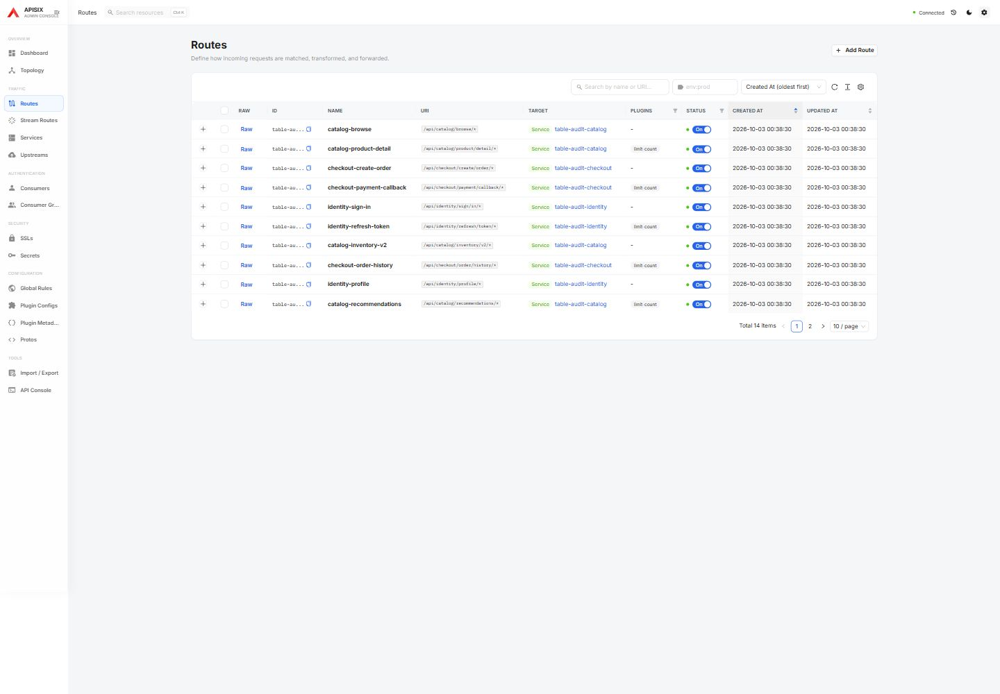
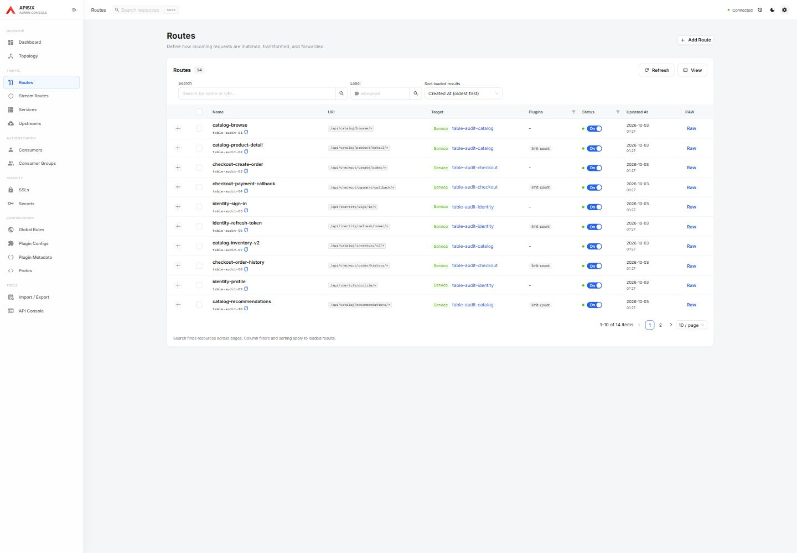
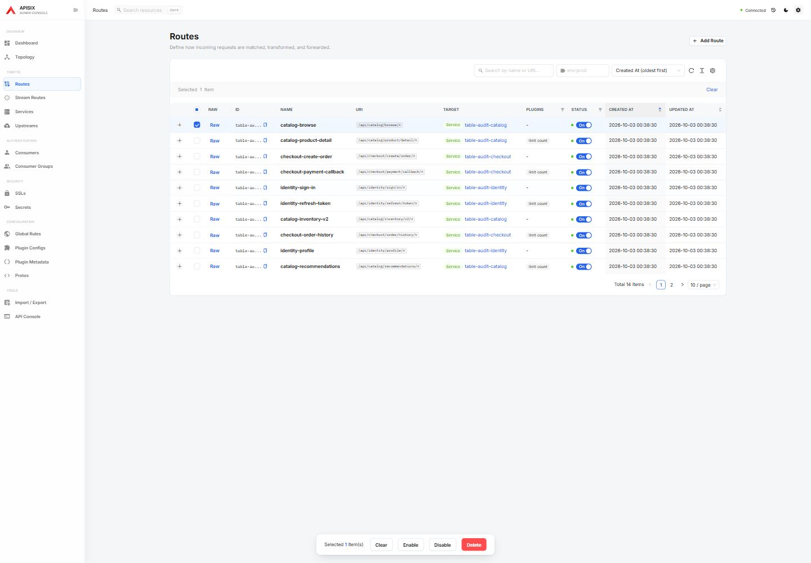
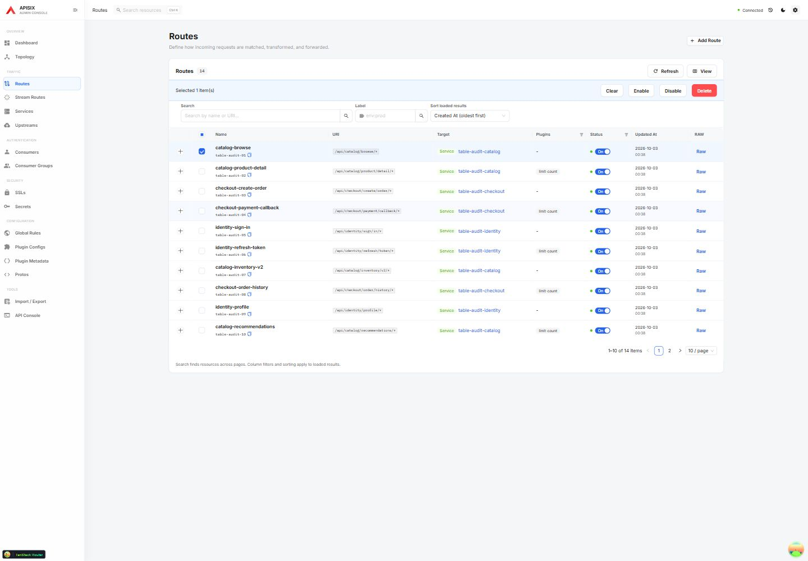
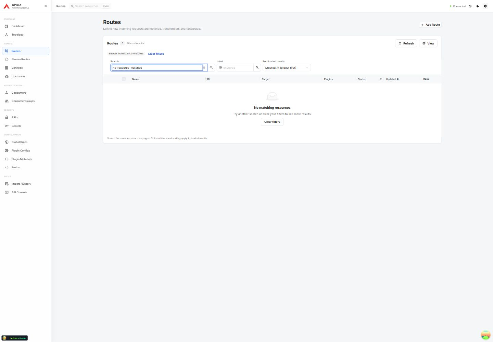
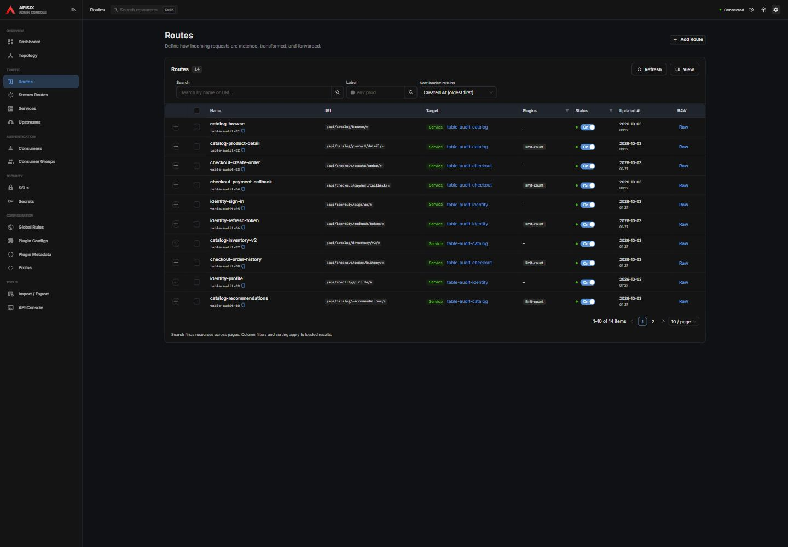
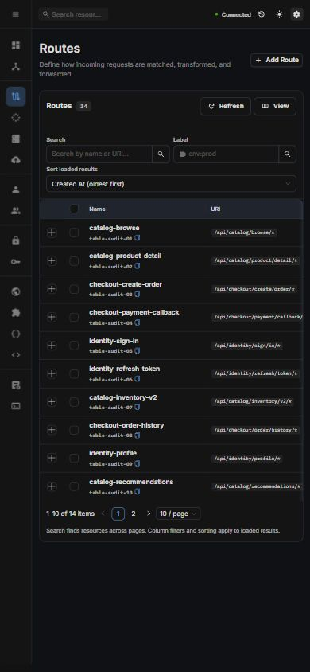

# Resource table experience

Review date: 2026-10-03. Baseline: `83f1fdba` (APISIX 3.19 support).
Screenshots use synthetic catalog, checkout, and identity resources on the local
APISIX 3.19 gateway. They contain no production data. Selection and empty-search
captures were taken in development; the final light/dark captures use the production build.

## Observed problems and changes

| Priority | Observed issue | Implemented response |
| --- | --- | --- |
| High | RAW and truncated IDs precede the resource name, making rows harder to scan. | Put identity first, combine names with copyable IDs, and move RAW to the right. Retain identity while scrolling on desktop. |
| High | Selection produces both an alert and a floating action bar. | Use one action region inside the table, with the existing confirmations and API behavior. Clear selection on page/filter changes. |
| High | Placeholder-only searches and icon-only view controls obscure purpose. | Add persistent field labels, explicit search submission, and named Refresh/View buttons. |
| Medium | Sorting can be controlled in two places with different state. | Keep one labeled sort control and disclose its loaded-result scope. |
| Medium | Empty collections and unsuccessful searches offer little recovery guidance. | Distinguish the states, summarize active filters, and offer Clear filters. Failed result pages now produce an error instead of partial search success. |
| Medium | Dense metadata and wide toolbars compete with operational fields. | Hide Created At by default, use compact date/time formatting, wrap controls on narrow screens, and offer persistent column/spacing choices with reset. |

## Before and after

Before: actions and metadata compete with identity.

After: identity, search, view controls, operational fields, and pagination have distinct positions.

Before selection:

After selection:

Search recovery:

Dark theme:

Narrow screen (390 px): controls remain within the viewport and the table scrolls horizontally.

## Verified flow

1. **Find a resource — healthy in tested scenarios.** Search across pages, apply a label, navigate back, and clear filters. An unavailable search page displays an error.
2. **Scan and customize — healthy in tested scenarios.** All 11 main resource lists share identity-first columns. Column choices and spacing survive reload; Reset view restores defaults; Escape returns focus to View.
3. **Act on a selection — healthy in tested scenarios.** One action region shows the selection. Delete still requires confirmation; cancel sends no write. Pagination clears selection.
4. **Continue on a narrow screen — healthy in tested scenarios.** No document overflow at 390 px; a labeled, focusable table region supports horizontal keyboard scrolling. Light and dark states were visually inspected.

The shared presentation also covers service-scoped route/stream-route lists,
consumer credentials, and GraphQL cost decorations. Plugin Metadata retains its
existing card presentation.

## Validation and boundaries

- `pnpm lint`, `pnpm exec tsc -b --pretty false`, and `pnpm build`.
- 20 focused Playwright scenarios cover shared controls, persistence, filtering,
  error/empty states, pagination, selection cancellation, and narrow-screen behavior.
- Existing resource-list, credential CRUD, GraphQL decoration, and helper tests
  were exercised against the production UI with a local APISIX 3.19 gateway.
- RAW row actions were manually checked to open the matching resource endpoint.
- Search spans pages. Column filters and sorting intentionally operate on loaded
  results; the UI states this scope. The result badge reflects the API/search total,
  while column-filter chips identify restrictions on loaded rows.
- This is a scoped UI/behavior review, not a complete accessibility certification
  or a production traffic/performance assessment.
