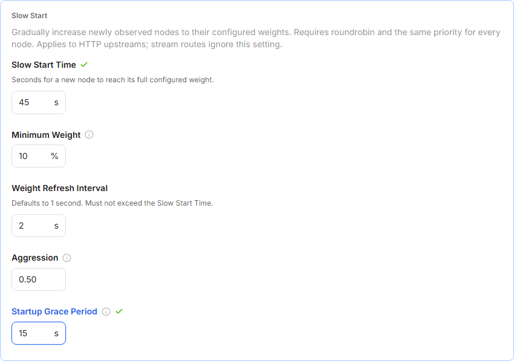
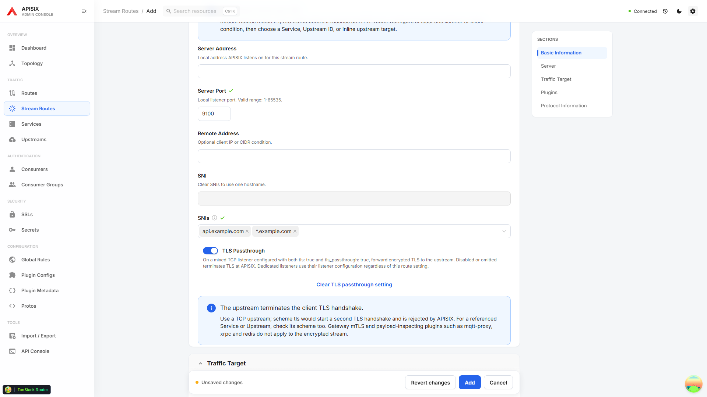
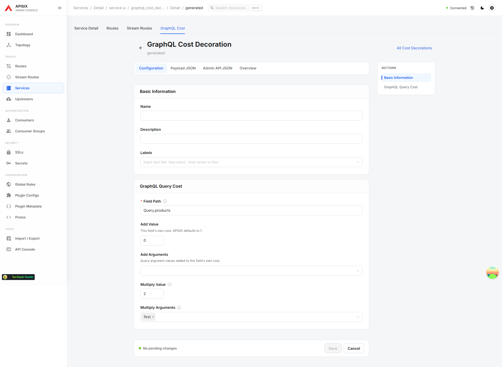
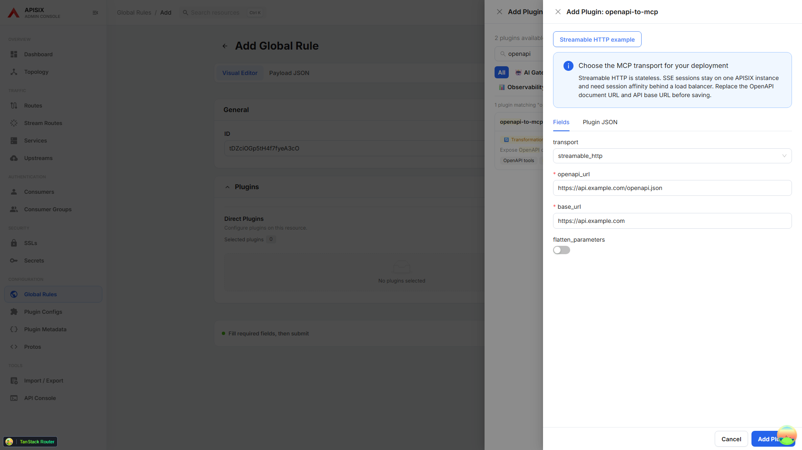

# APISIX 3.19.0 configuration support

The dashboard targets the [APISIX 3.19.0 release](https://apisix.apache.org/blog/2026/09/28/release-apache-apisix-3.19.0/).
The E2E gateway uses `apache/apisix:3.19.0-debian` so tests exercise a released API contract.
Older gateways can still use their existing features; new fields and plugins require a gateway version that supports them.
Plugin discovery and forms continue to use the connected gateway's enabled plugins and schemas.

## Upstreams

- `ws` and `wss` select APISIX's native WebSocket frame processing. Use them with `websocket-proxy` for frame limits. Existing HTTP/HTTPS `enable_websocket` continues to relay upgrades through NGINX.
- TLS settings accept a list of PEM CA certificates in `tls.ca_certs`. HTTPS and gRPCS honor `tls.verify`; existing configurations with verification enabled can reject previously accepted certificates after upgrading. Native WebSocket upstreams cannot use per-upstream CAs; configure the gateway's shared trust store for WSS.
- Optional **Slow Start** settings expose all `warm_up_conf` fields: duration, minimum weight percentage, interval, aggression and startup grace. Validation requires round-robin balancing, a common node priority and an interval no greater than the duration. Initially observed nodes are mature; later nodes ramp locally on each APISIX instance. Stream routes do not use slow start, and `traffic-split` does not support it.
- These controls also apply to inline upstreams in Routes and Services. Optional settings can be removed without resurrecting saved values; explicit `false` and `0` remain intact.

## Stream Routes

Use either **SNI** or **SNIs**. The latter accepts unique exact or wildcard names.
**TLS Passthrough** is an optional override on a mixed listener configured with both `tls: true` and `tls_passthrough: true`.
The listener itself must be configured in APISIX; changing a Route does not create a listener.
An encrypted passthrough connection terminates at the backend, so gateway mTLS and payload inspection are unavailable.
Do not select an upstream with `scheme: tls` for passthrough: that would attempt another handshake.

## GraphQL query costs

Open **Services → Service Detail → GraphQL Cost** to create, edit and delete cost decorations.
They are separate service-owned resources, stored through
`/apisix/admin/services/{service_id}/graphql_cost_decorations/{id}`.
The parent Service and resource ID come from the URL; timestamps and ownership are not sent as editable configuration.
Blank IDs use APISIX's generated ID; explicit IDs are preserved.

A decoration's `field_path` can name a type (`Product`), a field (`Query.products`), or a selection chain.
`add_value` and `add_arguments` control the field's own cost; `mul_value` and `mul_arguments` multiply the child cost.
Enable `graphql-limit-count` on the Service with `cost_strategy: complexity` or `node_quantifier` to use the decorations.
The default `depth` strategy does not use them. Set `max_cost` in the plugin to reject expensive queries.

Export format v3 includes `graphqlCostDecorations`, and imports restore Services before their decorations.
Older v1/v2 files remain accepted. APISIX 3.19's batch validation endpoint does not validate this subresource,
so the dashboard explicitly identifies its local schema checks; Service ownership and duplicate field paths are checked by APISIX on import.

## Plugin configuration

The plugin catalog includes `openapi-to-mcp` and `websocket-proxy`, with gateway-schema-checked quick starts.
New options for GraphQL costs, AI fallback responses, SAML validation, Redis TLS server names, WAF response logging and batch response limits come from the live plugin schemas.
Templates do not enable a plugin that the connected gateway has disabled.

Review the release's migration notes when adopting stricter basic-auth passwords, unique AI instance names, workflow actions, OIDC introspection issuer checks, Feishu/DingTalk callback state or JWE algorithms.

## Operational scope

This is an Admin API configuration UI. The release's Control API health checker endpoints and metric label changes are gateway/monitoring features, not dashboard-managed resources.
The API console can call the standalone `PUT /configs?wait=3000` endpoint when connected to an API-driven standalone deployment:
200 confirms all tracked workers applied it, 202 means accepted but not yet confirmed everywhere, and 204 means an unchanged digest.
The regular import flow continues to write individual etcd-mode resources; it does not send a standalone replacement configuration.

## Sources and checks

- [3.19.0 resource schemas](https://github.com/apache/apisix/blob/3.19.0/apisix/schema_def.lua)
- [GraphQL cost decoration API](https://github.com/apache/apisix/blob/3.19.0/apisix/admin/graphql_cost_decorations.lua)
- [Stream proxy configuration](https://github.com/apache/apisix/blob/3.19.0/docs/en/latest/stream-proxy.md)
- [Batch configuration validation implementation](https://github.com/apache/apisix/blob/3.19.0/apisix/admin/config_validate.lua)

Dedicated `*.apisix-319.spec.ts` tests cover schema constraints, visual/JSON round trips, request bodies and GraphQL CRUD.
`apisix-319.gateway.spec.ts` exercises configuration acceptance and persistence against the real gateway.
These tests validate the dashboard's configuration contract; they do not measure traffic forwarding, slow-start timing, TLS handshakes, GraphQL execution cost or LLM behavior.
