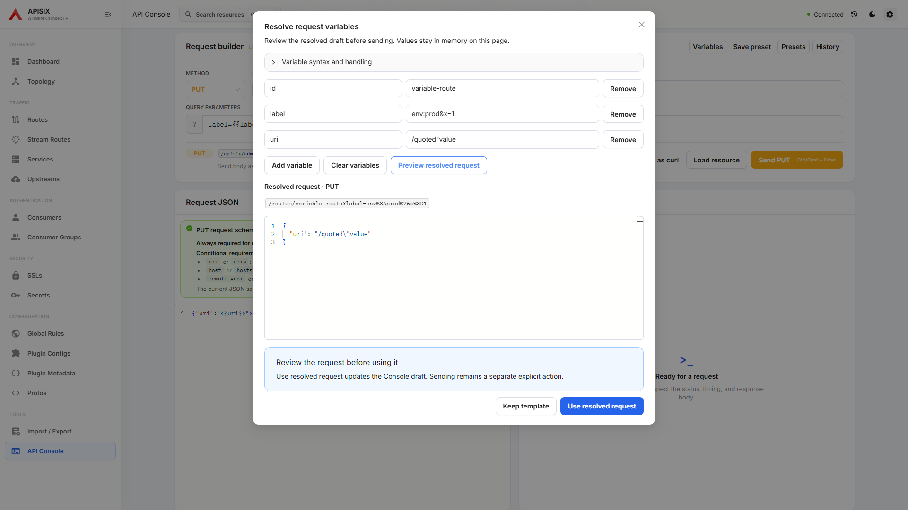
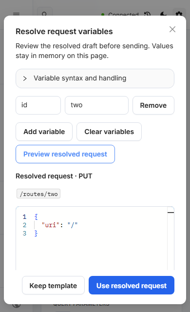
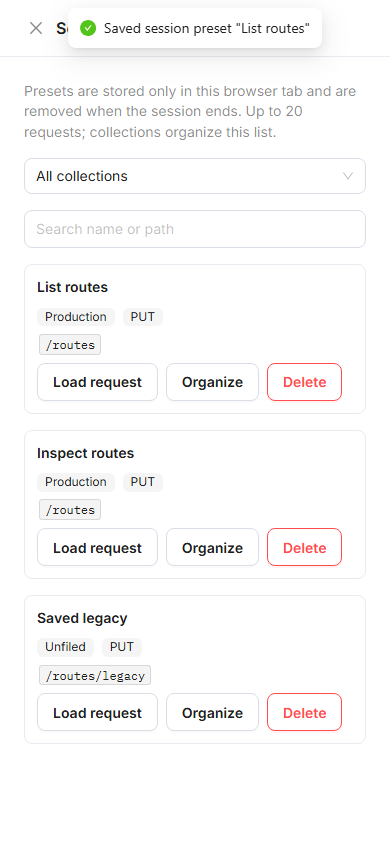

# Console collections and request variables

Session presets now have a collection and can be searched, renamed, moved and deleted in the Presets drawer. Legacy presets appear under Unfiled. Names are unique within a collection, ignoring case. Presets remain in session storage for the current browser tab. The 20-request limit blocks new entries instead of silently evicting the oldest request. Failed storage writes preserve the existing list and show an error.

Use `{{name}}` placeholders in the resource path suffix, query values and JSON string values. Open Variables, enter non-secret values and select Preview resolved request. Path/query substitutions are URL encoded; JSON substitutions preserve quoting and remain strings. Numbers, booleans, arrays and literal JSON property names retain their types and order. Missing or malformed placeholders, duplicate variable names, invalid JSON and dot path segments block resolution.

Variable values stay in component memory, with no new browser persistence. Keep template closes the preview without replacing the draft. Use resolved request updates only the Console draft; Send remains a separate explicit action. Editing any variable invalidates the previous preview. Ctrl/Cmd+Enter cannot send a request while the variable, preset or save-preset dialogs are open.

The short narrow-screen modal keeps its actions visible while its content scrolls. Syntax help is collapsible so the resolved request has useful editing space. Existing draft replacement and navigation guards still protect unsent work.

## Verification

Production-preview fixtures cover URL and JSON escaping, literal own keys, invalid/missing variables, no implicit requests, memory-only values, collection filtering and rename collisions, legacy presets, storage errors, the capacity limit and narrow layouts. Existing Console draft tests cover navigation, replacement and in-flight requests. The service-backed Console suite remains part of repository CI.

## Follow-up 56: isolate preset keyboard saving

A CI run intermittently opened the background PUT request review when Ctrl/Cmd+Enter saved a session preset. The preset name input called its save callback, which could close the dialog and replace the window shortcut listener before the same native keydown finished bubbling. Reading the dialog-open state in that later listener therefore did not establish which action owned the event.

The preset name input now prevents the Enter default and stops propagation **before** saving. Plain Enter, Ctrl+Enter and Meta+Enter still save the preset or show its existing validation/storage error. A separate shortcut from the Console continues to open the normal request review. The preset limits, storage format, request draft and API execution path are unchanged.

The unchanged production runtime reproduced the issue: Ctrl+Enter and Meta+Enter both opened an unintended PUT review; plain Enter also reached the window. The instrumented window listener observed `saved: true` for all three events, proving that saving preceded propagation. All three strengthened cases failed before the fix without changing timeouts or relaxing the no-review assertion. The tests retain the full 20-preset list, order of the other 19 entries, exact request path/query/body, and zero API writes during saving. Additional coverage checks empty-name validation, storage failure with the modal/draft preserved, and a later independent Console shortcut.

Verification on master `af26a5e` plus this fix: full ESLint, TypeScript and production build passed. Console collections/drafts and history coverage/contracts passed **55/55** against a production preview with synthetic Admin API responses. The three Enter variants and failed-save path then passed **40/40** across ten repetitions each, with no retry. The final narrow capture case also passed separately. The ordinary Console shortcut still opens its explicit PUT review after the preset dialog closes; saving a preset alone sends no request. Repository CI and live service checks remain separate gates.

[Saved preset with the Console request unchanged](../design/console-preset-shortcut/saved-desktop.png) · [Failed save keeps the 390px dialog and input](../design/console-preset-shortcut/failure-narrow.png).
