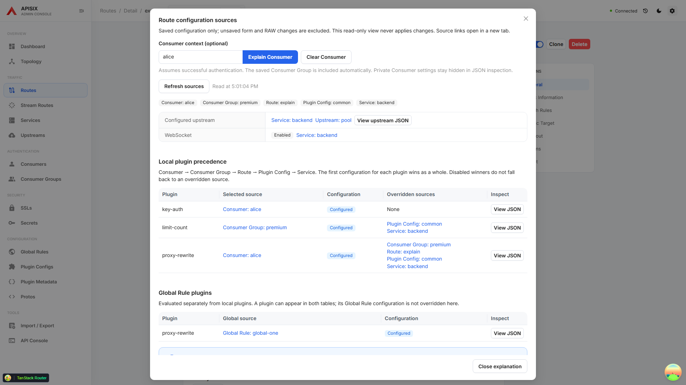
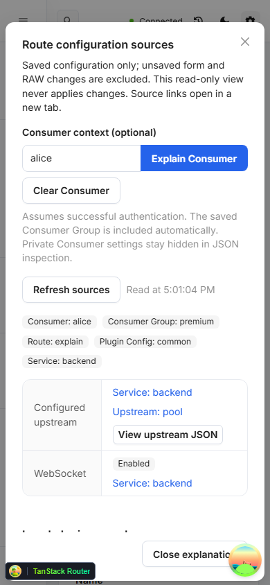

# Explain Route configuration for a Consumer

Open **Explain configuration** on a Route. Select a username from **Consumer context**, or enter an exact username and choose **Explain Consumer**. The explanation reads that saved Consumer and follows its `group_id` automatically. **Clear Consumer** returns to the Route-only explanation, and **Refresh sources** re-reads the active context.

Local plugin precedence is **Consumer > Consumer Group > Route > Plugin Config > Service**, following the [APISIX plugin merging rules](https://apisix.apache.org/docs/apisix/terminology/plugin/). Each plugin uses the winning configuration as a whole; lower-priority properties are not merged into it. Disabled winners remain disabled. Conditional plugins remain marked as conditional. Global Rule plugins are displayed separately and are not replaced by Consumer plugins.

This is a saved-configuration scenario after successful authentication, not proof that a request will authenticate or execute those plugins. Request filters, phases, scripts and plugin availability still apply. Consumer plugins do not change the displayed configured Route/Service upstream; plugins may select another upstream at runtime.

## Private settings and source inspection

Consumer and Consumer Group plugin values are hidden in the JSON inspector, including overridden configurations. The explanation shows their source, plugin names and disabled/conditional state. Use the source links to intentionally inspect or edit Consumer settings in the existing resource pages. Consumer suggestions cache only usernames; this feature does not read credential child collections, write resources or persist a Consumer selection.

## Incomplete or changing data

Detail responses must match the requested identity. Global Rule and Consumer suggestion lists must have consistent totals, complete pages and unique identities. Missing sources or invalid collection responses prevent a falsely complete explanation. If suggestions cannot load, an exact username can still be entered. Refresh retries the active context.

Changing or clearing the Consumer prevents a late response from replacing the new context. The view does not alter unsaved Form or RAW drafts. Reads occur separately and are not an atomic snapshot.

