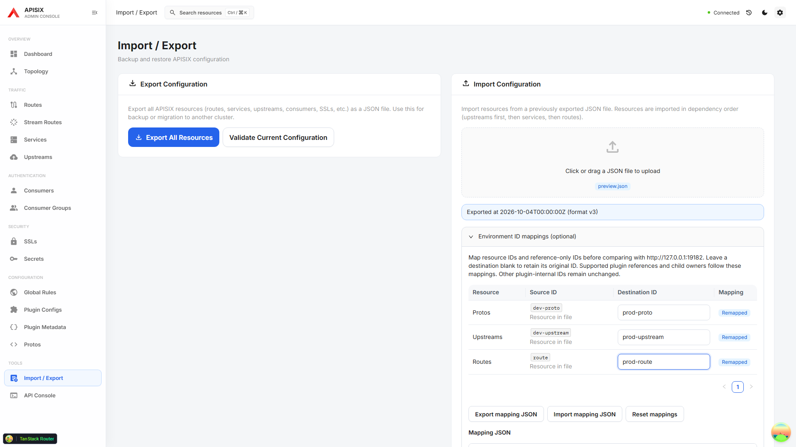
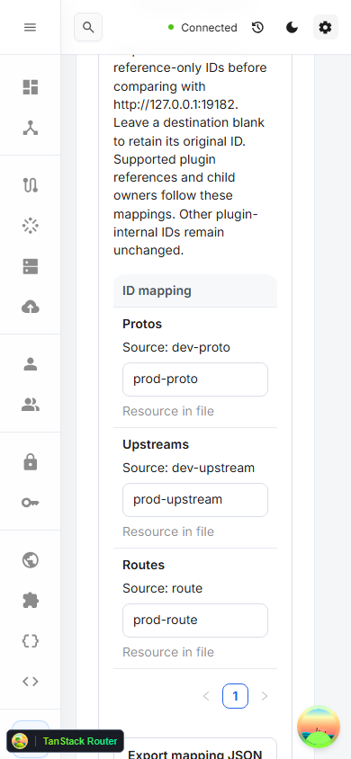

# Environment ID mapping

Open **Export / Import**, upload a configuration export, and expand **Environment ID mappings**. The table lists resource IDs, IDs referenced by supported fields, and any entries loaded from mapping JSON. Enter a destination ID or leave it blank to retain the original. The uploaded configuration is preserved.



## Supported mappings

The mapping object retains its existing format and now also supports `protos`:

```json
{
  "routes": { "dev-route": "prod-route" },
  "upstreams": { "dev-upstream": "prod-upstream" },
  "protos": { "dev-proto": "prod-proto" }
}
```

Supported resource keys are `routes`, `streamRoutes`, `services`, `upstreams`, `pluginConfigs`, `consumers`, `consumerGroups`, and `protos`. Consumer usernames are mapped as their resource identity. The table and editable JSON stay synchronized; use **Import mapping JSON** and **Export mapping JSON** to reuse a mapping.

Standard references follow the mapping: Route / Stream Route Service and Upstream IDs, Route Plugin Config IDs, Service Upstream IDs, Consumer Group IDs, and the Consumer or Service owner of Credential and GraphQL Cost Decoration records.

The same known plugin paths used by reference diagnostics and opt-in dependency export are mapped:

- `grpc-transcode.proto_id` points to a Proto.
- `traffic-split.rules[].weighted_upstreams[].upstream_id` points to an Upstream.

These paths are recognized on Routes, Stream Routes, Services, Plugin Configs, Consumers, Consumer Groups, and Global Rules. Inline Upstreams and traffic-split fallback entries are preserved. Other plugin-internal IDs and unknown properties remain unchanged; this is not automatic discovery of arbitrary plugin relationships.

## Preview and import

Conflicting destination IDs, invalid destinations, and unsupported mapping types show an error while the mapping remains editable. Collisions include mapping one resource onto another unchanged ID in the same file.

**Compare with current** prepares the import preview without writing. The exported source and destination columns identify address changes. **Review mapping** compares the exported payload with the mapped payload. **Compare JSON** separately compares the destination's current configuration with the proposed import.

Known references must either resolve to an unblocked resource in the import plan or pass an exact destination read with matching identity. Missing, unreadable, or malformed references block the affected item. A new dependency in the file must remain selected when a selected item needs it. Immediately before each write, the existing concurrent-change check and the known-reference checks run again.

Import is a sequence of Admin API writes, not an atomic transaction. A failed dependency or concurrent change can produce partial results; inspect each result before retrying. Unknown plugin relationships still require manual review.

On narrow screens each row stacks the source ID and destination input, keeping keyboard editing and validation available without horizontal scrolling.


