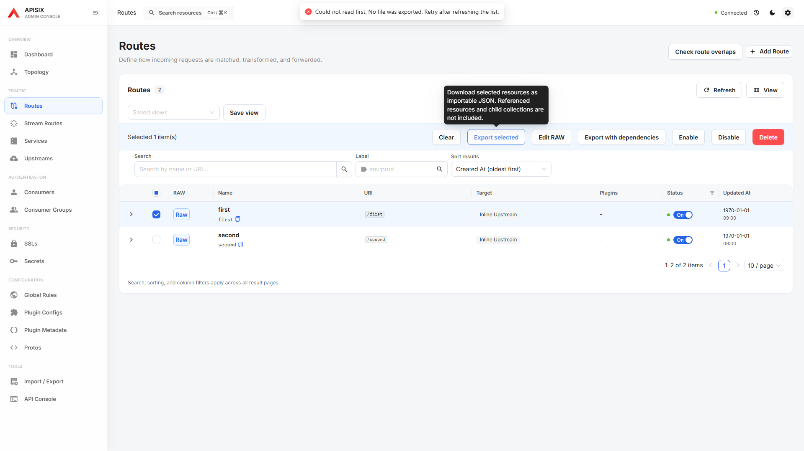

# Export identity verification

Selected-resource exports verify each Admin API detail response before normalizing its exported ID, Consumer username or Secret manager. A missing, malformed or different identity prevents the entire download and keeps the selection available for a retry. Reads have a 15-second timeout. The error names the requested resource; returned content from a mismatched resource is not shown.

Dependency bundles use the same exact-path validator before adding a resource or following its references. A mismatched resource or envelope key is shown as unreadable, blocks the bundle download, and cannot introduce dependencies from that response. Service GraphQL child values are validated against their owner and child path before export metadata is added; a collection reported as empty must still pass the Service owner detail check. Existing complete-pagination, duplicate-child and changing-total checks remain in force.

Numeric IDs, URL-encoded IDs, Secret composite IDs and Consumer usernames remain supported. Returned envelope keys, when present, must match the requested canonical path under the configured etcd prefix. Plugin Metadata is the exception that requires a matching envelope key because its value may omit `id`. Unknown JSON properties and explicit own special keys are preserved after verification.

This validation does not turn sequential reads into an atomic gateway snapshot, expand dependency scope or alter import payloads. The shared `validateExactResourceSnapshot` utility is also used by import verification.

## Verification

Fixture-only Playwright coverage exercises successful selected downloads across resource types, mismatched Route/Consumer/Secret values, wrong envelope keys, Plugin Metadata identity, malformed coercible IDs, dependency traversal exclusion and GraphQL owner/child checks. Failed reads produce no download and no Admin API write.

