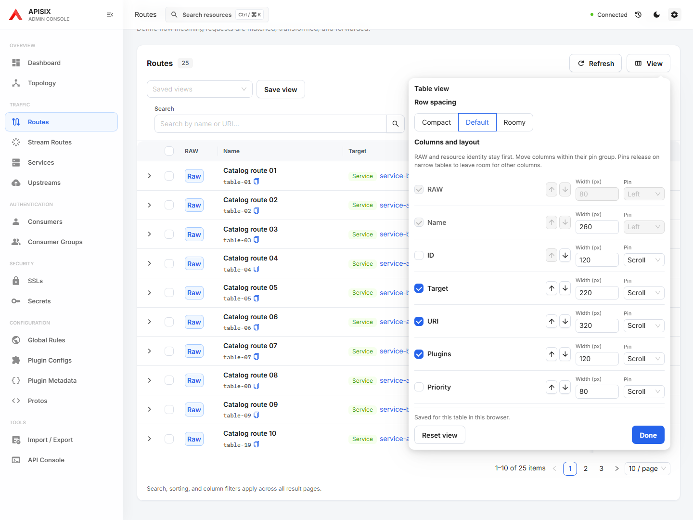
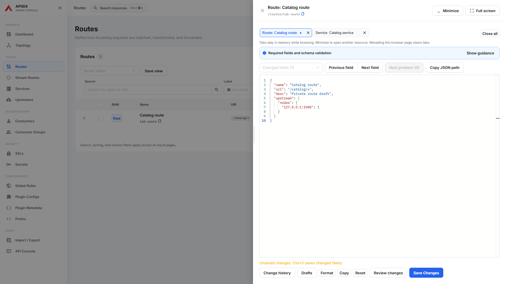

# Getting Started

This guide walks through running the Next-Gen APISIX Dashboard, connecting it to
an APISIX Admin API, and using the main screens that operators touch every day.

The dashboard is a static React SPA. It does not run `manager-api`, does not keep
its own resource database, and does not synchronize APISIX state through a
separate service. Resource data comes from the APISIX Admin API.


## What You Need

Before opening the UI, prepare:

*   A running APISIX gateway with the Admin API enabled.
*   An Admin API key from your APISIX `config.yaml`.
*   A way for the browser to reach `/apisix/admin` from the same origin as the
    dashboard, or a development proxy configured through Vite.

For local development, the repository includes a Docker Compose environment:

```bash
docker compose up -d
pnpm install
pnpm dev
```

By default, the Vite development server proxies `/apisix/admin` to
`http://localhost:9180`. To target another gateway:

```bash
VITE_APISIX_API_TARGET=http://your-apisix-host:9180 pnpm dev
```

Open the UI at:

```text
http://localhost:5173/ui/
```

## First Connection

On first launch, the dashboard asks for an APISIX Admin Key. Enter the key from
your APISIX configuration and click **Test**.

The key is stored in local browser storage and sent as `X-API-KEY` on Admin API
requests. The dashboard does not send the key to a separate dashboard backend.

When the connection is healthy, the header shows **Connected** and the Dashboard
screen begins loading live resource counts, recent changes, plugin usage, and
health information.

## Read the Gateway at a Glance

The Dashboard page is the best starting point after connecting.

Use it to answer:

*   How many managed resources are available?
*   Are any routes disabled or SSL certificates expiring?
*   Which resources changed recently?
*   Which plugins are most commonly applied?
*   Is the Admin API returning complete data?

If APISIX cannot load a collection, the dashboard keeps the available data
visible and marks the missing area as unavailable instead of hiding the whole
screen.

## Manage Routes

The Routes list is optimized for scanning gateway traffic rules.


From this screen you can:

*   Search by route name or URI.
*   Filter by labels such as `env:demo`.
*   Sort by creation or update time.
*   See the upstream or service target.
*   Review applied plugins without opening every route.
*   Toggle route status.
*   Open the Admin API payload for quick inspection.

Routes are still APISIX resources. The UI does not create dashboard-only fields;
it presents the Admin API payload with friendlier controls.

## Customize Resource Tables

Open **View** above a resource list to adjust row spacing and column visibility.
Use the up/down buttons to reorder columns within a pin group, enter a width in
pixels, or choose **Left**, **Scroll**, or **Right**. RAW and the resource identity
remain first so common actions stay easy to find. Additional pins temporarily
release when the table is too narrow; your choices return when more room is
available. **Reset view** restores the default layout, and **Done** closes the
panel. All controls work with the keyboard; Escape returns focus to **View**.

Use **Save view** to keep the layout together with search, labels, sorting,
column filters, and page size. Views are stored in this browser for each table;
existing saved views continue to work. Changing a table layout never changes
APISIX resource data.

If browser storage is unavailable, layout changes still apply to the current
page. A persistent warning replaces the saved status. **Retry save** stores the
latest layout when storage becomes available; leaving or reloading before a
successful retry may restore the previous layout. Named views remain unchanged
when saving or deleting a view fails.



## Review a Resource

RAW keeps **Review changes** and **Save Changes** together below the editor tools.
The save area stays visible while scrolling expanded guidance in the RAW panel.
Formatting, copying, encrypted drafts, change history, impact analysis, and
related-resource inspection remain available above it. Tooltips also appear
when Format or Copy receives keyboard focus.

Open a route detail page to inspect its identity, lifecycle, relationships, and
applied configuration.


The detail page has three working modes:

*   **Overview**: scan the resource without editing it.
*   **Configuration**: update the resource through structured form controls.
*   **Admin API JSON**: patch the saved APISIX resource directly with schema guidance.

Use the structured form for routine edits and the Admin API JSON editor when you
need to inspect or patch the saved APISIX object directly. When creating a new
resource, the **Payload JSON** tab edits the same draft payload that the visual
editor will validate and submit.

## Keep Multiple RAW Resources Open

Open **RAW** from a resource list to add it to the shared workspace. **Minimize**
keeps each tab's draft and editor position while you browse other pages. The RAW
button in the header reopens the workspace and shows its tab count; its dot marks
unsaved edits. Opening the same API resource again selects its existing tab.

Each tab saves only its own changed fields. A background save or late response
cannot replace another tab's draft. Switch tabs with the left/right arrow keys,
Home, or End; Delete closes the focused tab. Closing a dirty tab or **Close all**
asks before discarding drafts, and saving tabs cannot be closed.

Tabs and resource values stay in memory only. Browser reload or leaving the app
clears them; the browser warns while any tab is dirty or saving, including when
the workspace is minimized. Use the existing encrypted **Drafts** feature when
you need recovery after a reload. Nothing is automatically saved to APISIX.



## Understand Traffic Relationships

The Topology page visualizes the live relationship between Routes, Services, and
Upstreams.


Use it when you need to answer:

*   Which routes point to this service?
*   Which upstream will receive traffic?
*   Are multiple routes sharing the same service?
*   Does the configured path match the intended backend?

Click a node to inspect it. Double-click a node to open its detail page.

## Use the API Console Carefully

The API Console sends direct APISIX Admin API requests from the browser.


It is useful for:

*   Inspecting an Admin API response without leaving the dashboard.
*   Testing a payload before moving it into a resource form.
*   Reproducing Admin API behavior while debugging.

The console is intentionally marked as advanced. For normal resource changes,
prefer the resource pages because they include safer validation and payload
cleanup.

## Deployment Notes

The production dashboard expects Admin API requests at `/apisix/admin` from the
same origin as the static UI. The simplest production deployment is to serve the
dashboard from APISIX itself with Admin UI support enabled.

For standalone static hosting, place a reverse proxy in front of the dashboard
that forwards `/apisix/admin` to the gateway Admin API. This avoids browser CORS
issues and keeps the UI deployment static.

## Security Notes

*   Use a scoped Admin API key when possible.
*   Serve the dashboard over HTTPS in shared environments.
*   Avoid committing `.env.local` files or real Admin API keys.
*   Restrict APISIX Admin API access by network policy, firewall rules, or
    APISIX `allow_admin` settings.
*   Treat the API Console like direct Admin API access.

## Troubleshooting

### The header says `Server error`

Check that the dashboard can reach `/apisix/admin` and that the Admin API key is
valid. In development, confirm `VITE_APISIX_API_TARGET` points to the correct
gateway.

### The settings dialog keeps opening

The Admin Key is missing or invalid. Re-enter it from APISIX `config.yaml` and
click **Test**.

### Static hosting works, but API requests fail

The static files are loading, but `/apisix/admin` is not being proxied to APISIX.
Add a same-origin reverse proxy rule for `/apisix/admin`.

### Resource counts look incomplete

Some Admin API collections may be unreachable, disabled, or unsupported by the
target APISIX version. The Dashboard shows partial data and marks unavailable
collections explicitly.
