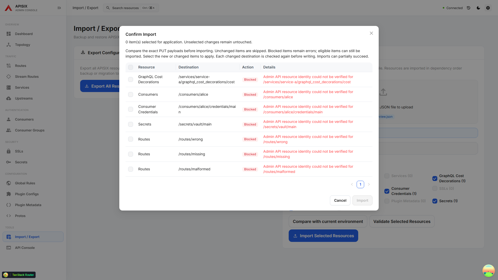

# Import destination identity verification

Import preview validates that each detail response belongs to the exact requested destination before comparing editable JSON. A response with an absent, malformed, or mismatched identity is **Blocked**. The error names the requested path and does not display the unexpected response body or another Consumer's username.

The same validation runs during the fresh read immediately before a changed resource is written. An identity change is rejected even when its editable fields happen to match the earlier preview. A changed import destination also requires a new preview.

When Import records resource history, its final prerequisite snapshot is also compared with the reviewed destination. A concurrent edit, a newly occupied ID, deletion, or unreadable response stops that item before PUT and creates no history entry. A verified 404 remains an explicit missing resource; it is not replaced with a later read.

## Supported response identities

- Top-level resources use their own `id`; numeric and string IDs compare by textual value. Consumers use their own `username`.
- Credentials accept the short ID or the supported `username/credentials/id` composite form. Returned `username`, when present, must match the requested owner.
- Secrets accept the short ID or `manager/id`; returned `manager`, when present, must match.
- GraphQL Cost Decorations check the child ID and any returned `service_id`.
- Plugin Metadata may omit `value.id`, so it requires the exact envelope `key`. An optional returned ID must agree.
- A supplied envelope key must match the destination path, allowing the configurable etcd prefix. Keys use unescaped path segments.

The shared validator never edits a snapshot or fills missing primary identities from the import file. Only after validation does import normalize supported composite identities and supply export-only owner metadata for its existing PUT payload builder. This keeps response validation separate from payload sanitation.

Successful reads are still individual Admin API requests, not an atomic transaction. Existing change checks reduce accidental overwrites but do not provide compare-and-swap guarantees.

Response forms follow the APISIX 3.19 [resource handler](https://github.com/apache/apisix/blob/3.19.0/apisix/admin/resource.lua), [v3 response adapter](https://github.com/apache/apisix/blob/3.19.0/apisix/admin/v3_adapter.lua), and [GraphQL child resource](https://github.com/apache/apisix/blob/3.19.0/apisix/admin/graphql_cost_decorations.lua), together with the dashboard's existing Secret and Credential endpoint wrappers.
