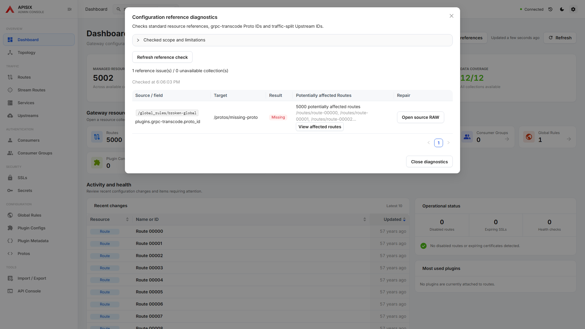
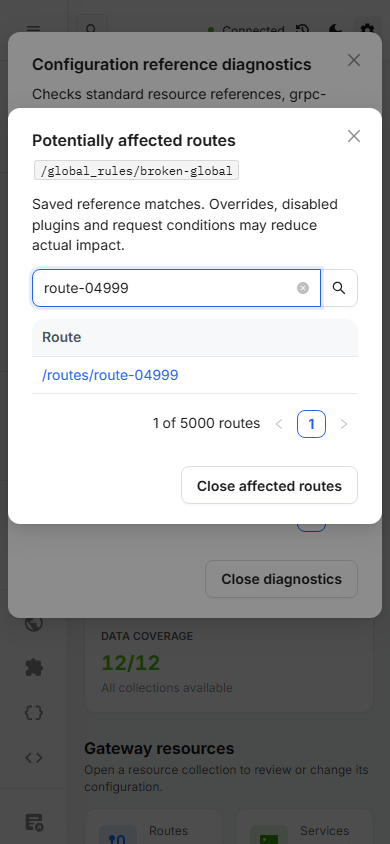

# Large-data measurements

These are local Chromium observations, not production service latency targets.
The fixture suite uses intercepted Admin API reads and asserts that no writes
occur. Run against a production build, not Vite's development server:

```powershell
pnpm build
pnpm preview --host 127.0.0.1 --port 19183 --strictPort
$env:E2E_TARGET_URL='http://127.0.0.1:19183/ui/'
pnpm exec playwright test e2e/tests/large-data.performance.spec.ts --workers=1 --reporter=list
```

Each case attaches a `large-data-metrics` JSON record. Timing values are recorded
without CI thresholds because hardware, browser startup, animation, and other
workloads affect them. Behavioral assertions cover pagination/search, preserved
RAW drafts, one live workspace editor, model disposal, and reachable repair.

## Method and observations

Measured on Windows x64, Ryzen 9 5950X (32 logical CPUs), 64 GiB RAM, Node 24.16.0,
Playwright 1.57.0 Chromium, 1920x1080. Baseline: master `f7878f95`.
The before/after numbers below are one sequential sample per case on the same
machine. Do not interpret small timing changes as an improvement or regression.
Heap is the main renderer JS heap after forced GC via Chromium CDP; it excludes
workers and is not the browser's total RAM.

| Workload | Baseline | Candidate | Decision |
| --- | --- | --- | --- |
| 5,000 Routes, initial display | 690 ms | 782 ms | Existing 10-row pagination is retained. |
| Search across all 5,000 Routes | 177 ms | 175 ms | No table/search rewrite justified by this sample. |
| 527,070-byte JSON, edit to next rendering opportunity | 46 ms | 44.5 ms | Existing JSON validation and diff behavior retained. |
| Large JSON open / review | 666 / 503 ms | 607 / 568 ms | No latency improvement claimed. |
| 20 large dirty RAW tabs, live Monaco widgets | 20 | 1 | Only the active tab mounts its widget. |
| 20 large dirty RAW tabs, JS heap after GC | 289.8 MiB | 121.1 MiB | Keep draft models and undo history; suspend hidden widgets. |
| Switch back to first dirty RAW tab | 586 ms | 530 ms | Same draft, cursor, scroll, and undo are restored. |
| Close all RAW tabs | 0 widgets; 77.7 MiB heap | 0 widgets; 76.5 MiB heap | Disposed model verified separately; engine caches need not return heap to startup size. |
| Global Rule with 5,000 affected Routes | About 23,000 px in one row | About 100 px | Show count and three examples; inspect all routes through a paginated searchable dialog. |
| Read and display Global Rule diagnostics | 473 ms | 481 ms | Improvement is bounded UI size and repair reachability, not read latency. |

RAW tabs retain models while open so undo history is not discarded on every
switch. All models are disposed when their tabs close. No drafts or model
contents are newly persisted to browser storage. Background saves keep their
existing session state and synchronize the retained model when the tab returns.

The diagnostics inspector shows 10 route links per page, searches the entire
affected list, and keeps links and close controls usable at 390px. Small impact
lists remain inline. The original diagnostics scope and partial-read warnings
still apply; potential impact does not imply actual request execution.




## Follow-up limits

These fixtures do not simulate gateway network latency, service-side load, all
possible plugin documents, or unlimited tabs. Large retained models and undo
history still consume memory. Do not add destructive model eviction without a
user-visible policy that protects drafts and undo. The existing Vite bundle-size
advisory remains separate from the measured editor-widget overhead.