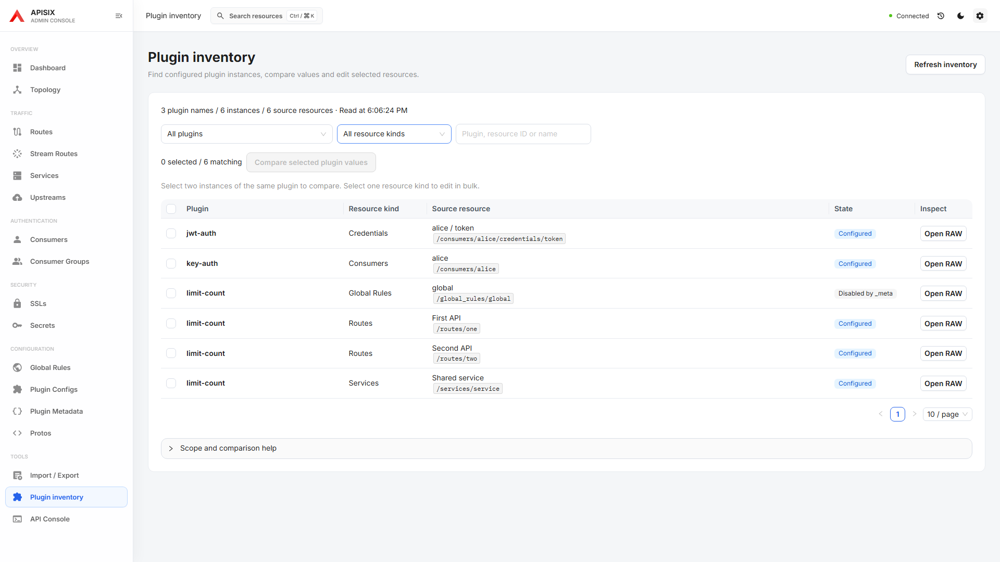
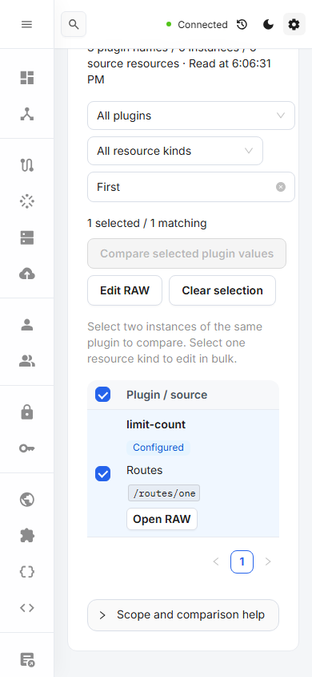

# Plugin inventory

Open **Tools → Plugin inventory**, or use global search, to find saved plugin instances across Routes, Stream Routes, Services, Consumers, Consumer Groups, Global Rules, Plugin Configs and Consumer Credentials.

- Filter by plugin, resource kind or resource name/path. Plugin choices show instance and distinct configuration counts. Disabled `_meta` instances remain visible.
- Select two instances of the same plugin to compare their JSON. Object key ordering is normalized; array ordering and all own keys remain significant.
- Select one supported resource kind and choose **Edit RAW** to enter the existing bulk preview, concurrency check, apply and read-back verification flow. Repeated rows from one resource are deduplicated. Credentials use individual RAW editing.
- **Open RAW** inspects the original resource in the shared workspace. Configuration values are displayed only when the operator opens RAW or comparison.
- Refresh clears old rows and selection before reading again. Changing filters clears selection so hidden rows are not silently included.

All pages are read with stable totals and unique verified resource identities. A failed, duplicate, malformed or changing collection is identified as a partial inventory; missing rows never prove that a plugin is unused. Bulk editing is disabled for partial results until a complete refresh succeeds. Credentials are read in bounded batches, with the repository's existing 404-as-empty list convention.

The inventory describes saved configuration. It does not resolve inheritance, runtime activation, installed plugin versions or Plugin Metadata. Reads are not an atomic snapshot. No payload is persisted by the inventory.

## Verification

ESLint, TypeScript and production build, plus 10 focused Playwright cases covering semantic values and own keys, complete/paginated reads, malformed/partial responses, compare-only behavior, explicit bulk PATCH and read-back, filter selection, Credential RAW navigation and 390px layout. Desktop and narrow screenshots use the production bundle and were inspected.

