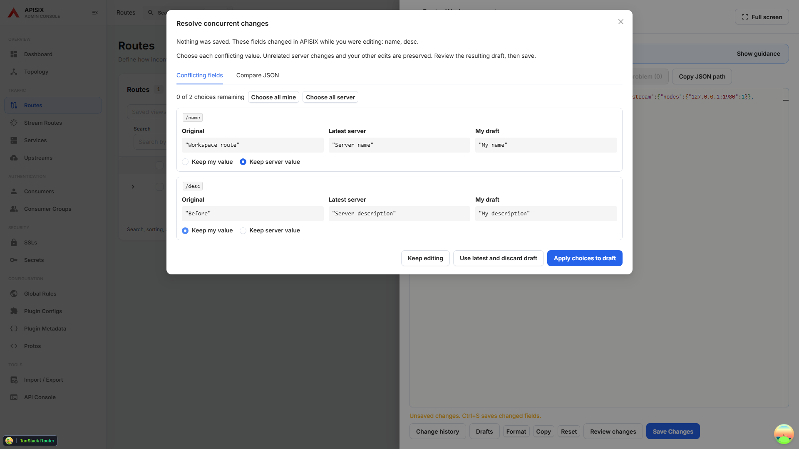
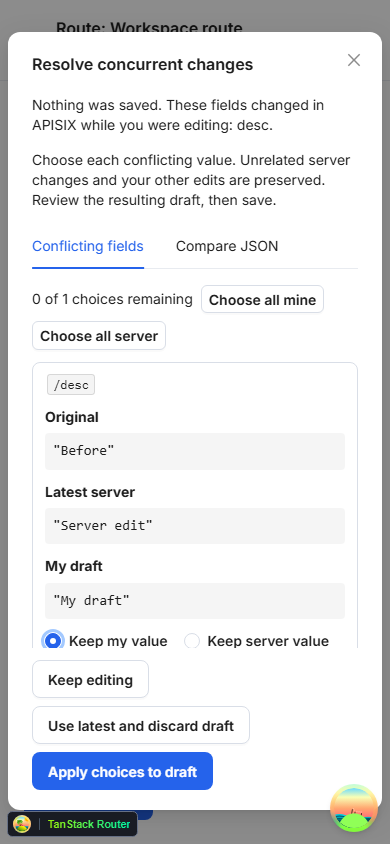

# Resolve concurrent RAW changes

When another operator changes a field you are editing, RAW stops before sending a write and opens **Resolve concurrent changes**.

1. Inspect the original value, latest server value, and your draft for every conflicting field. Fields use JSON Pointer paths so dots and slashes inside keys are unambiguous.
2. Choose **Keep my value** or **Keep server value** for each field. **Choose all mine/server** fills the choices without applying them.
3. Select **Apply choices to draft**. This preserves unrelated changes from both sides and returns the result to the editor. No API write occurs yet.
4. Review the resulting JSON or use **Review changes**, then save. RAW checks the server again and reopens conflict resolution if a chosen field changed in the meantime.

**Keep editing** closes the dialog without changing your draft. **Use latest and discard draft** replaces the entire draft with the latest resource read for the conflict. Arrays are resolved as whole values. If a parent object was removed or changed to another type, choose the whole object. A removed field is distinguished from a server JSON null.

The **Compare JSON** tab retains the full server/draft comparison. Keyboard users can navigate radio choices and all actions. On narrow screens the three values stack vertically, while the dialog body scrolls and actions remain available.

This is optimistic concurrency protection. Separate Admin API reads and writes are not an atomic transaction; a change made after the final check can still race with a write.
