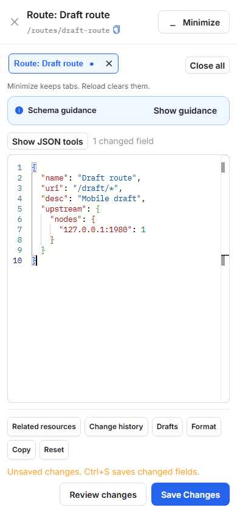
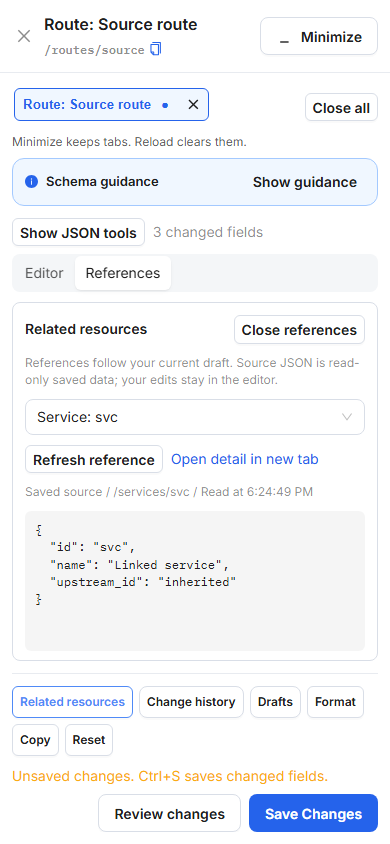

# RAW on narrow screens

RAW keeps the draft visible when its panel is less than 560px wide. Open
**Show JSON tools** for changed-field selection, previous/next navigation and
JSON path copying. **Escape** from a tool closes the group and returns focus to
the toggle. The wide panel continues to show these tools directly.

Editor shortcuts still work while the group is folded: **Alt+[ / Alt+]** for
changed fields, **F8** for the next problem, and **Alt+Shift+C** to copy the JSON
Pointer. Schema errors and the next-problem button remain visible immediately;
folding navigation never suppresses validation or saves a draft.

The schema heading and tab hint use shorter text on phones. The hint still
explains that minimizing retains tabs and reloading clears them. Resizing a
panel closes an open changed-field selector safely and preserves the draft.

At 390x844 the regression fixture retains more than 300px of editor height;
folding the tools recovers more than 75px compared with the expanded state.
Reference inspection and Review/Save remain reachable. No JSON payload or API
write behavior changes.

