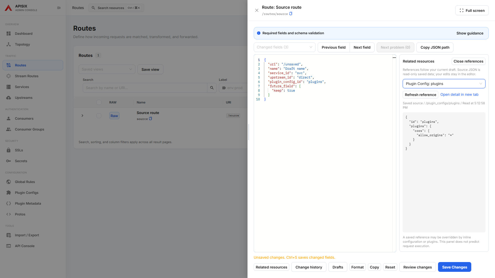
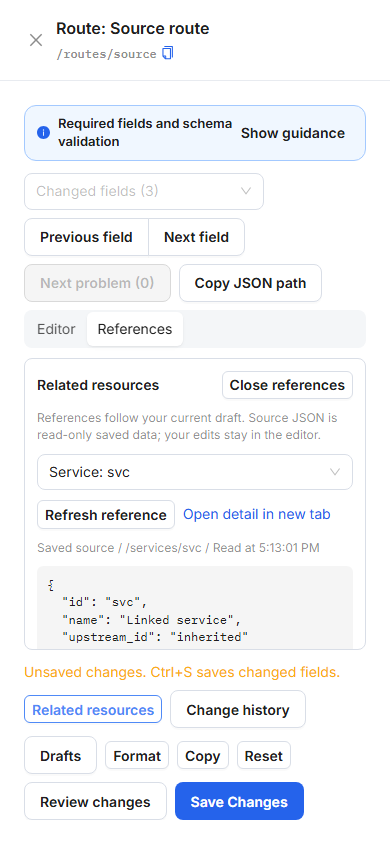

<!--
Licensed to the Apache Software Foundation (ASF) under one or more
contributor license agreements. See the NOTICE file distributed with
this work for additional information regarding copyright ownership.
The ASF licenses this file to You under the Apache License, Version 2.0
(the "License"); you may not use this file except in compliance with
the License. You may obtain a copy of the License at

    http://www.apache.org/licenses/LICENSE-2.0

Unless required by applicable law or agreed to in writing, software
distributed under the License is distributed on an "AS IS" BASIS,
WITHOUT WARRANTIES OR CONDITIONS OF ANY KIND, either express or implied.
See the License for the specific language governing permissions and
limitations under the License.
-->

# Inspect references while editing RAW

Open **Related resources** in a Route, Stream Route, or Service RAW editor
to read linked saved resources without replacing the current draft. The
selector follows IDs in the draft and can show a Service's saved Upstream.
Routes additionally support Plugin Config references. Inline objects remain
in the main editor.

On wide editors the source JSON appears beside the draft. On narrow screens,
**Editor / References** switches views while preserving the draft and cursor.
**Close references** returns keyboard focus to the editor.

The inspector performs GET requests only, checks the returned resource ID,
and shows loading, read time, unavailable resources, and retry explicitly.
A changed reference cancels obsolete reads; typing unrelated fields does not
reload source JSON. **Refresh reference** reloads saved data, and **Open detail
in new tab** keeps the current draft open.

This is saved configuration inspection, not an execution trace. Inline
configuration and plugins may override a saved reference. Invalid draft JSON
or malformed reference IDs must be corrected before their references can be
inspected. Consumer credentials are outside the inspector's resource scope.

