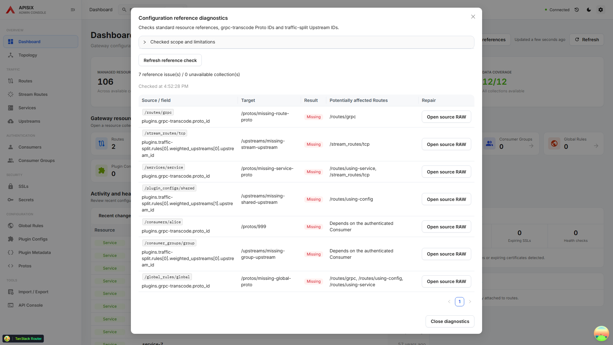
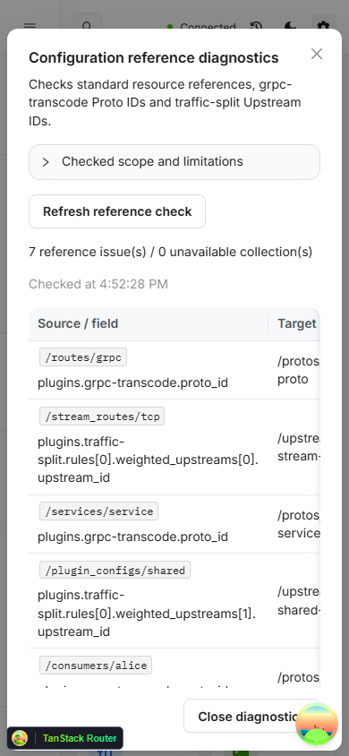

# Configuration reference diagnostics

Open **Check references** from Dashboard or Topology to inspect saved configuration. The check is read-only. Each reported row identifies the source resource, exact field, target and potentially affected Routes. **Open source RAW** opens the saved source for repair; saving or closing the editor refreshes the report.

## Checked references

- Route and Stream Route `service_id` / `upstream_id`, Route `plugin_config_id`, Service `upstream_id`, and Consumer `group_id`.
- `plugins.grpc-transcode.proto_id` referencing Protos.
- `plugins.traffic-split.rules[].weighted_upstreams[].upstream_id` referencing Upstreams. Inline upstreams and entries that fall back to the Route upstream are not ID references.

Known plugin paths are checked in Routes, Stream Routes, Services, Plugin Configs, Consumers, Consumer Groups and Global Rules. Numeric and string IDs are compared by their textual value. A missing required Proto ID or a malformed ID value is reported as **Invalid reference**.

**Missing** means a valid ID was absent from a completely read target collection. **Not verified** means the target collection could not be read reliably. Failed reads, inconsistent totals, duplicate IDs and incomplete pagination keep the report incomplete; refresh before drawing conclusions.

## Scope and limitations

This is a saved-reference check, not full plugin schema or runtime validation. Other plugin references, scripts and dynamic routing are outside the checked scope. Disabled or locally overridden plugins are still checked so stale saved references remain visible. Reads do not form an atomic snapshot.

Potentially affected Routes include direct owners, Routes connected through Services or Plugin Configs, and all saved HTTP Routes for a Global Rule. Consumer and Consumer Group plugin impact depends on the authenticated request and is not inferred from Route configuration. Incomplete source collections can also make affected Route lists incomplete.

The scope explanation is expandable. The result table scrolls horizontally on narrow screens, and the close action remains visible while results scroll.

