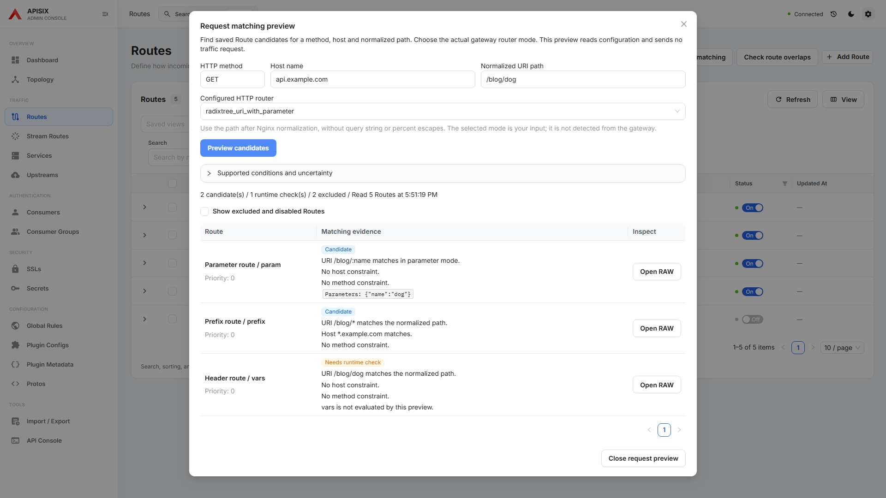
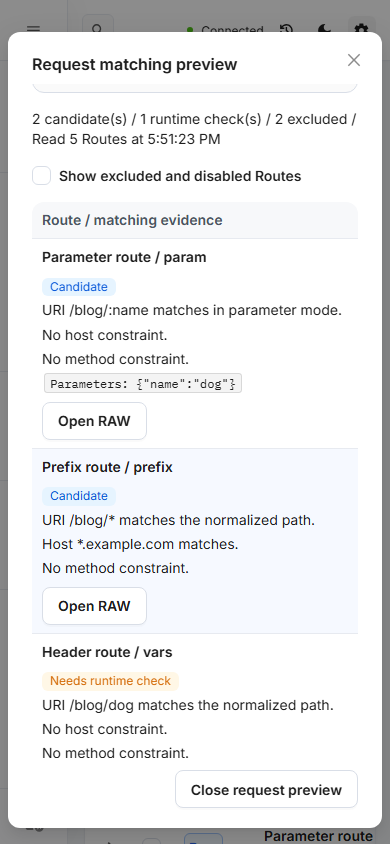

# Request matching preview

Routes → **Preview request matching** reads the complete saved Route collection and explains which Routes are candidates for a method, hostname and already normalized URI path. Select the HTTP router actually configured on the gateway; the dashboard does not detect this mode from the Admin API.

Supported conditions:

- Literal and trailing-prefix URIs, including URI arrays.
- Exact and leading-wildcard hostnames with dot boundaries, including host arrays.
- HTTP method sets. GET does not imply HEAD.
- In `radixtree_uri_with_parameter` mode, complete `:name` segments and final `*name` catch-all segments, with extracted parameters.
- Disabled Routes and definite method, host or URI exclusions.

The result distinguishes **Candidate**, **Needs runtime check**, **Excluded** and **Disabled**. It does not choose a winner: priority, specificity and router ordering can still resolve multiple candidates. Address conditions, `vars`, custom filter functions and unsupported patterns remain explicit runtime checks. Plugins, rewrites, authentication and upstream health are outside the preview.

Enter the path after Nginx normalization, without percent escapes, query strings, fragments, duplicate slashes or dot segments. Host input accepts DNS-style names without ports or schemes. This initial preview does not support IPv6 host literals. Invalid or incomplete reads clear previous results; editing inputs also invalidates them. Reads are not an atomic gateway snapshot.

The preview only makes Admin API GET requests. It never sends a traffic request. **Open RAW** opens the selected configuration for inspection through the existing editor; its save actions remain explicit. At narrow widths the results become cards inside a scrollable dialog with a reachable Close action.

## Verification

- ESLint, TypeScript and production build.
- 23 focused Playwright cases: 18 matching fixtures, explicit uncertainty/input validation, read failures/recovery, read-only requests, RAW navigation and narrow layout.
- The same 18 golden fixtures were executed directly against `resty.radixtree` installed in the existing APISIX container, whose `apisix/core/version.lua` reports **3.19.0**. All 18 passed. This verifies those library matching cases, not live Nginx request normalization or the complete gateway routing pipeline. The check used an independent in-memory process and no Admin API credentials or configuration writes.
- Desktop and 390px screenshots below were inspected.

Reference semantics: [APISIX radixtree router](https://apisix.apache.org/docs/apisix/router-radixtree/), [router terminology](https://apisix.apache.org/docs/apisix/terminology/router/), and [lua-resty-radixtree parameter paths](https://github.com/api7/lua-resty-radixtree#parameters-in-path).

