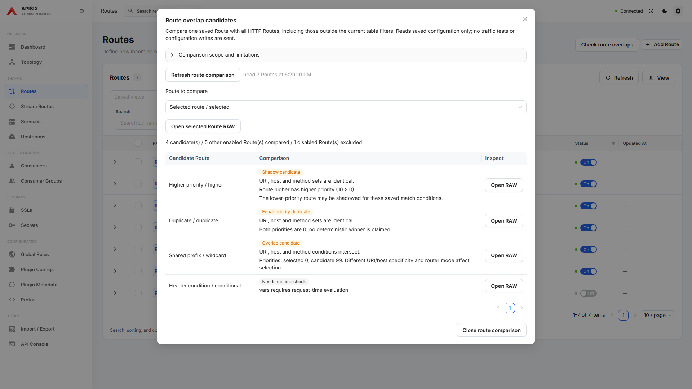
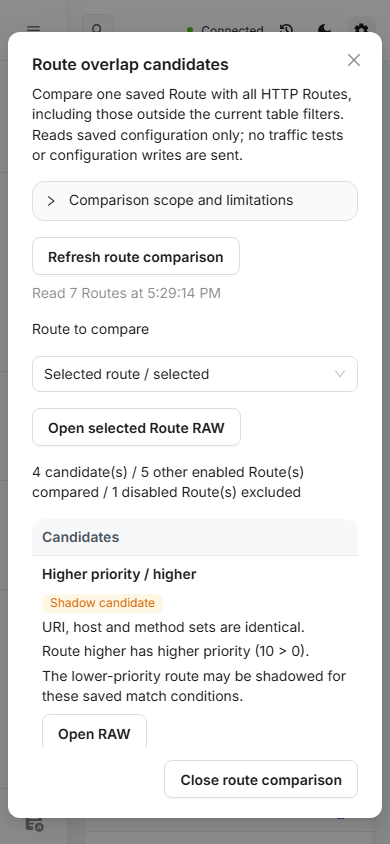

# Route overlap candidates

Open **Check route overlaps** on the Routes page. Pick one saved HTTP Route to
compare with all saved HTTP Routes, independently of current table filters.
The comparison reads every page and rejects malformed, duplicate, incomplete
or changing totals. Refresh after editing; the reads are not an atomic snapshot.

- **Overlap candidate**: supported URI, host and method conditions intersect.
- **Shadow candidate**: supported match sets are identical and one priority is
  higher. This is a candidate for review, not proof of live request behavior.
- **Equal-priority duplicate**: supported match sets and priorities are equal;
  no deterministic winner is claimed.
- **Needs runtime check**: unsupported patterns, parameters, normalization,
  remote addresses, vars, filter functions or malformed match data prevent
  a complete static comparison.

Disabled Routes are excluded and counted explicitly. The comparison supports
literal and trailing-wildcard URIs, exact and leading-wildcard hosts, HTTP
method sets, and integer priorities. Different URI or host specificity is
never ranked solely by priority. Host wildcard checks preserve the dot
boundary, and URI prefix checks retain the exact prefix (including `/`).
The implementation follows the documented
[APISIX 3.19 routing rules](https://apisix.apache.org/docs/apisix/router-radixtree/).
Router mode, Nginx configuration and live request conditions still matter.

**Open RAW** inspects the selected source through the existing RAW flow.
Merely comparing candidates performs no writes or traffic tests. If a read
fails, previous results are cleared and the comparison can be refreshed.
On narrow screens candidates stack vertically and the primary close action
remains visible. The searchable Route selector supports keyboard selection.

