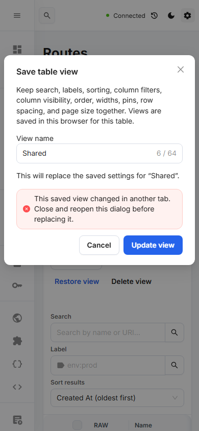

# Saved table views across tabs

Saved views synchronize when another tab changes the same table's browser storage. This updates the available presets and their Modified status without changing the active table's filters or layout.

Every save, delete and restore reads current storage. Adding a view preserves another tab's additions. An update or delete opened before the same view changes is blocked, with guidance to review and reopen the action. A removed view cannot be silently restored by a stale update. Invalid JSON or an unavailable storage read blocks mutation instead of replacing existing data with an empty list.

Where Web Locks is available, writes use a browser-wide lock for this storage key; a busy lock fails visibly and requires an explicit retry. Environments without Web Locks still get fresh reads and storage-event synchronization, but no atomic cross-tab guarantee is claimed. Storage failure keeps the active table and existing saved data available.

Browser fixtures use two real pages in one browser context and intercepted gateway requests. They cover simultaneous open save dialogs, remote updates and deletes, lock contention and retry, fresh reads without storage events/Web Locks, and unreadable stored data. Existing table behavior, layout migration, selection, storage errors, keyboard controls and narrow screens are included in the regression suite.

