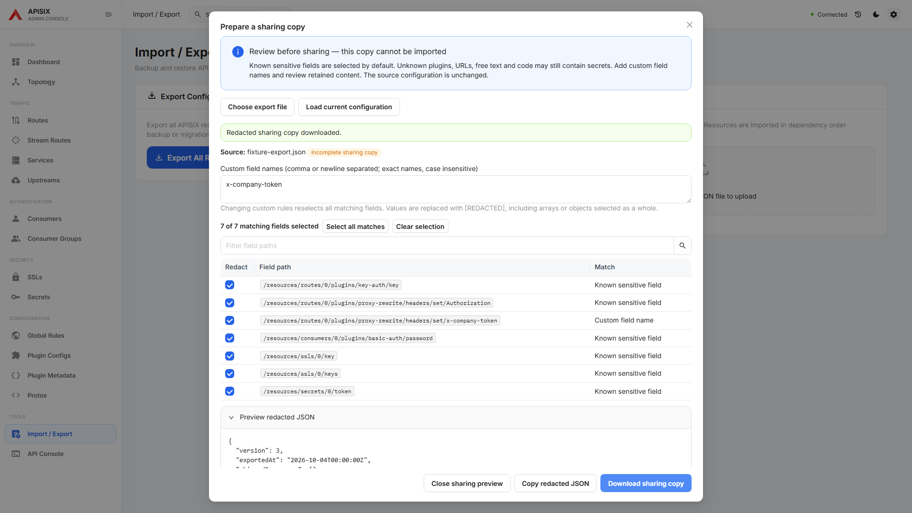
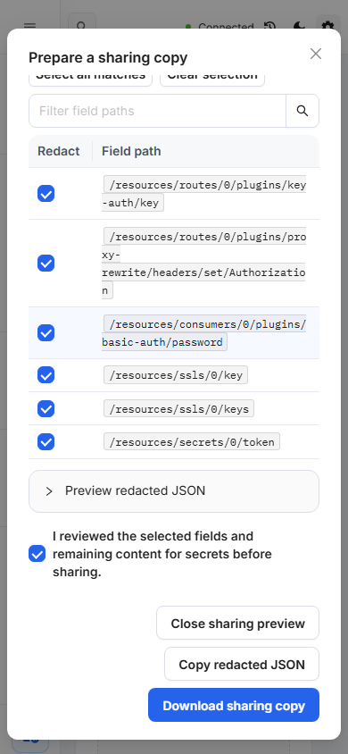

# Redacted configuration sharing

Use **Import / Export → Prepare redacted copy** to review an existing export file or explicitly load the current gateway configuration. Local files stay in the browser; loading the current gateway uses the existing read-only exporter. Nothing is written to APISIX.

Known sensitive fields are selected automatically: passwords, tokens, API keys, private keys, authorization headers, supported authentication plugin keys, SSL private-key arrays, and Secret authentication file references. Exact custom field names match case insensitively across resource objects and arrays. Changing custom rules reselects every matching field. Review individual JSON-pointer paths, clear or select matches, and open the redacted JSON preview before acknowledging the review and copying or downloading.

The rule list is deliberately a heuristic, not a complete secret detector. Unknown plugins, URLs, free text, code and values used as object keys can contain confidential information. Add the relevant custom field names (or their containing object field) and inspect the retained JSON. Unchecking a path keeps its original value in the output. Public certificates, IDs and usernames remain visible unless selected by a custom rule.

## Sharing format and restore protection

Only a detached copy is changed. Selected values become `[REDACTED]`; selected objects and arrays are replaced as a whole. Unknown properties and array order are otherwise preserved, including own `__proto__`, `constructor` and `prototype` JSON keys. The source object is not mutated.

Every generated copy, even with zero selected fields, includes `_apisixSharing` metadata with format `apisix-dashboard-sharing-v1`, `incomplete: true`, `importable: false`, and the redacted JSON-pointer paths. It is explicitly not a backup. Original skipped-resource metadata is retained. The Import UI, ID mapping, current-environment preview, configuration validation and import executor all reject the presence of this marker before Admin API requests. Use the original export for restoration. Removing the marker manually defeats this accidental-restore guard; it is not a cryptographic protection or a restriction on the API Console.

The dialog keeps source data and custom rules only in memory and clears them when closed. It does not write raw content to browser storage. Clipboard and file output happen only on their respective buttons after review. Copy failures leave download available. File errors, files over 10 MiB and nesting beyond 100 levels are reported without echoing malformed input; replacing a source or changing rules clears prior review. A delayed earlier file cannot replace a newer file or repopulate a closed dialog.

## Verification

`e2e/tests/sharing-redaction.spec.ts` uses fake values and mocked Admin API responses. Coverage includes known/custom fields, array and special-key preservation, immutable originals, all restore guards, malformed and bounded inputs, download/clipboard contents, replacement races, clipboard failure, partial current-export reads, keyboard interaction, and a 390px viewport. No destructive gateway suites are required for these fixtures.

