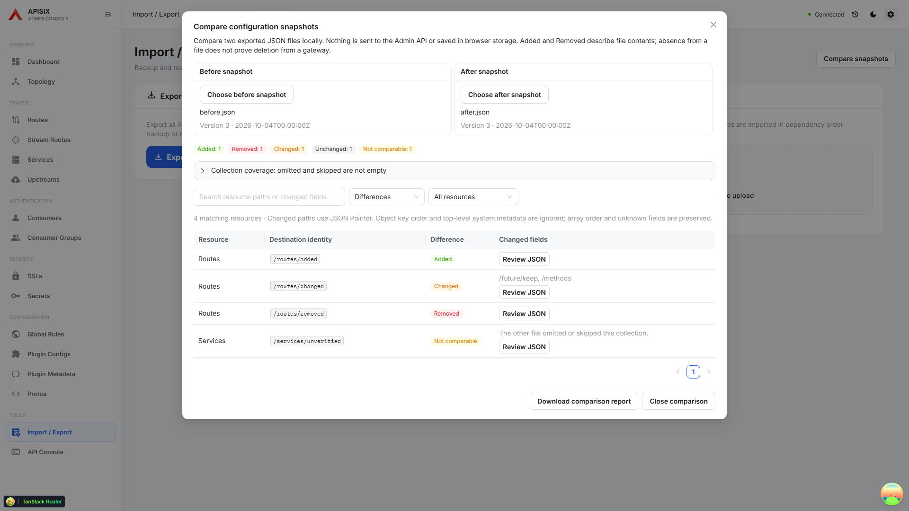
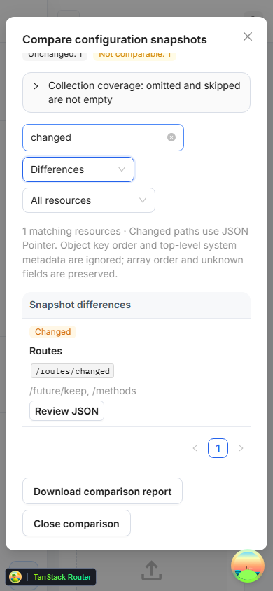

# Compare exported configuration snapshots

Open **Import / Export → Compare snapshots** and choose a before and after JSON export. The comparison runs in memory on your device. It does not read or write the Admin API, import resources, or persist files in browser storage. Closing the comparison clears the selected files.

## Reading the report

Resources are matched by their canonical Admin API destination: numeric and string IDs share an identity, Consumers use usernames, Secrets include their manager, and Credentials / GraphQL Cost Decorations include their parent owner. Same-named child resources under different parents remain separate.

- **Added / Removed** describe presence in the two files, not proven additions or deletions on a gateway.
- **Changed** means editable configuration differs. Object key order and top-level ID / system timestamps are ignored. Child owner metadata is part of the resource identity. Unknown configuration properties and array order are preserved; nested timestamp-like properties still count as configuration.
- **Unchanged** means the compared configuration is equal under those rules.
- **Not comparable** means a resource is absent on a side whose collection was omitted or marked skipped. Absence is not treated as an empty collection.

Expand **Collection coverage** to see each side's included count and Present, Omitted, or Skipped status. Human-readable legacy partial-scope entries in `skippedResources` conservatively mark all included collections as partial. Older selected-resource exports can contain empty arrays without a machine-readable scope marker; no file comparison can prove complete gateway coverage from those files.

Search resource paths or changed fields, filter by difference or resource type, and use **Review JSON** for a stable object-key-ordered diff. Changed fields are listed as JSON Pointers, including escaped slash and tilde keys. Arrays keep their original ordering.

## Download and validation

**Download comparison report** exports all compared rows, counts, collection coverage, source filenames and metadata, changed paths, and normalized before/after payloads. Display filters do not exclude report data. Before download, the dialog explains that supplied credentials or private keys remain in the report; review the file before sharing.

The supported export versions are 1–3. Unknown collection names, duplicate destinations, missing or malformed identities, mismatched composite owners, malformed arrays, invalid timestamps, and invalid JSON are rejected with a per-file error. Correct the file or choose a replacement to retry. Files are limited to 10 MiB and 100 levels of JSON nesting. A slower earlier file read cannot replace a newer selection.

Narrow screens stack the resource identity, difference, and review action while keeping the close and download buttons visible. Filter choices are exposed as accessible options, and the search clear button participates in keyboard navigation.

