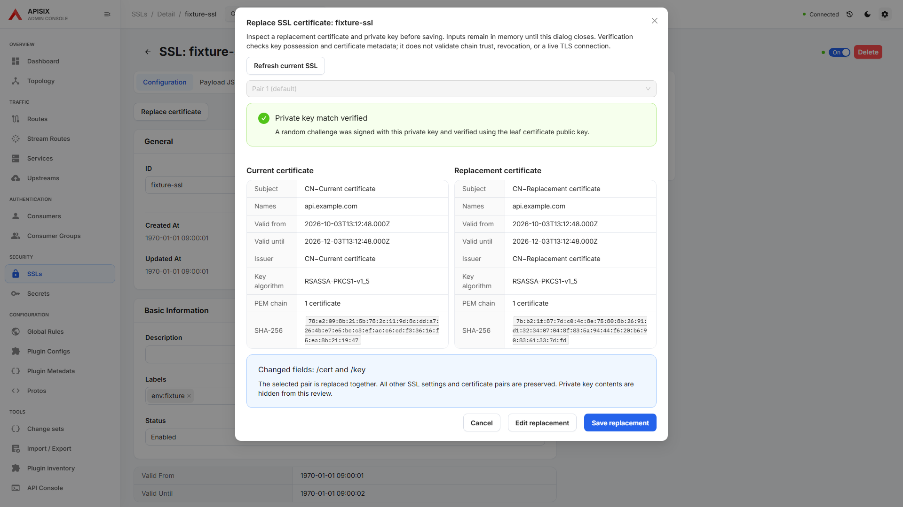
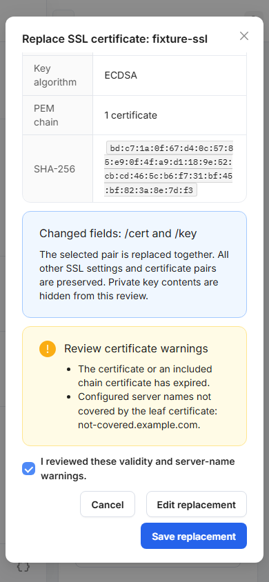

# Replace an SSL certificate

Open an existing SSL in **Configuration** and choose **Replace certificate**.
Save or reset existing form changes first. Choose the default pair or an existing
additional pair, paste PEM text or load local files, and select **Inspect replacement**.
The dialog compares the current and replacement subject, DNS/IP names, validity,
issuer, key algorithm, certificate count, and SHA-256 fingerprint. The selected
certificate and private key are submitted together; other SSL settings are preserved.

The browser proves the key match by signing a random challenge and verifying it
with the leaf certificate public key. It supports RSA and ECDSA certificates with
unencrypted PKCS#8, RSA PKCS#1, or EC SEC1 private keys. Certificate bundles must
place the leaf first. Secret references, encrypted keys, and unsupported algorithms
receive explicit messages. Every PEM input is limited to 1 MiB. An unavailable or
masked **unchanged** key blocks the helper because a complete SSL PUT cannot
safely preserve that key.

Expired, future-dated, and uncovered server-name warnings require acknowledgement
before **Save replacement**. This checks metadata and key possession; it does not
validate certificate-chain trust, revocation, or a live gateway TLS connection.

Saving reads the exact SSL again and rejects a changed baseline. This is a
preflight check, not an atomic compare-and-swap: APISIX can still change between
GET and PUT. The accepted PUT is followed by readable-field verification and the
shared resource history flow. The result explicitly distinguishes verified
readable fields from protected private keys, which Admin API read-back cannot
verify. An uncertain save result requires a refresh before retrying; writes are
never automatically repeated.

PEM inputs and pending inspection stay in memory. Closing or leaving with pending
inputs asks before discarding them; saving prevents closing. The helper does not
write private keys to browser storage, logs, or the review display. Existing
history/archive controls retain their own memory and explicit encryption behavior.

The parser uses the existing Peculiar X.509/ASN.1 package versions already in the
lockfile, promoted to explicit dependencies. The parser is loaded only when the
helper opens (production chunk approximately 194 kB, 47 kB gzip).

- [APISIX Admin API: SSL resource and PUT](https://apisix.apache.org/docs/apisix/admin-api/)
- [APISIX certificate formats and additional certificate pairs](https://apisix.apache.org/docs/apisix/certificate/)
- [Peculiar X.509 parser](https://github.com/PeculiarVentures/x509)

## Validation

The final integration onto master `9aa9229a` passed frozen offline dependency
installation, full ESLint, `tsc -b --pretty false`, and the production build.
The SSL replacement, SSL tag keyboard, SSL/Upstream validation, draft navigation,
Change sets core/UI, and history write-contract suites passed **94/94** against
an isolated production preview. All Admin API responses were intercepted fixtures;
the certificates and RSA/EC private keys were generated by the tests.

The 13 replacement cases cover PKCS#8/PKCS#1/SEC1 key possession, additional pairs,
wrong or masked keys, exact-baseline conflicts, failed or stale read-back without
automatic retry, stale asynchronous inspection, local file size limits, unsaved
form preservation and navigation discard. The captures above were refreshed from
that build and reviewed at desktop and 390px. These results do not claim a live
gateway TLS handshake or completion of service-backed CI.
